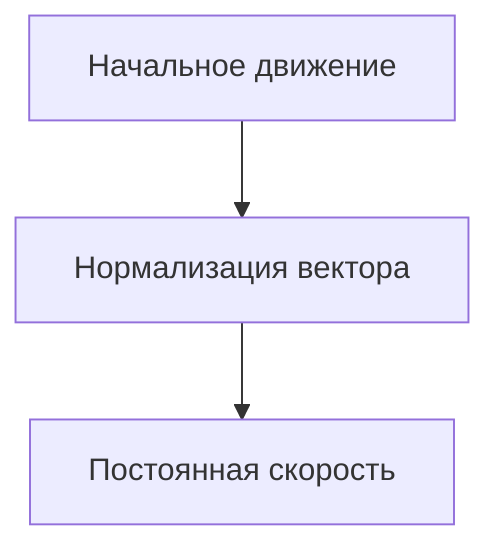

# Урок 1 - главный герой

## Игрок

### Создание игрока (передвижение на клавиатуре)

Начнем с создания игрока. Выбирайте `Другой узел`, чтобы выбрать любой другой узел в качестве корневого в сцене.


Основным узлом будет `CharacterBody2D` и к нему мы присоединяем `AnimatedSprite2D`, `Camera2D` и `CollisionShape2D`


>[!Tip]
>На скрине представлены параметры камеры. Вы можете воспользоваться ими, или же подобрать на свой вкус

>[!WARNING]
>Прежде чем двигаться дальше, обязательно в инспеторе, у узла `CharacterBody2D`, в свойстве `Motion Mode`, выставите значение `Grounded`. Это необходимо чтобы персонаж при столкновениях не дёргался. 

#### Анимация

У спрайта создаем 3 анимации:
* Бездействие (лицом вниз)
* Идем вверх
* Идем вниз


Чтобы добавить кадр из спрайт-лист (это картинка с кучей кадров), нужно нажать на следующую кнопку:


Находите нужный спрайт-лист, настраиваете количество линий и выбираете необходимые кадры:


>[!Note]
>Сколько и какие кадры вставлять в анимацию зависит от `спрайт листа` который вы используете.

Так же необходимо выставить смещение (`offset`). На картинке ниже пример, ваши значения могут отичаться. Выставляйте значение так чтобы низ персонажа был на одной линии с верхней линией viewport.


>[!Tip]
>В будщем это понадобиться для точго чтобы персонаж мог заходить за другие объекты.

#### Коллизия

Коллизию задаем у нижней части игрока, так как игра изометрическая.


>[!Tip]
>Помимо стандартных параметров вы можете использовать `Skew` и `Rotation`, в разделе `Transform`, у узла `CollisionShape2D`. Так вы сможете придать коллизии форму как у шахатной фигуры.

#### Камера
Про камеру нужно поговорить чуть-чуть подробнее, если вы раньше особо не трогали её свойства.

- `Zoom` отвечает за приближение камеры к её центру
- `Position Smoothing` включает плавность камеры
- `Process Callback` изменяет поведение камеры. Чтобы камера не дёргалась в режиме `Position Smoothing` обязательно поставьте его в значение `Physics`

#### Скрипт игрока
Прикрепите скрипт к корневому узлу `CharacterBody2D`, который следует переименовать в `Player`. Рекомендуйте называть узлы осмысленно и с большой буквы, без пробелов. Такой стиль наименования называется [CamelCase](https://ru.wikipedia.org/wiki/CamelCase).

#### Скорость

```gdscript
@export var speed = 100 # экспортируемая переменная, которая добавляется в инспектор узла к которому прикреплен скрипт.
```


#### Движение главного героя

Сперва задаём движение только для одного любого направления:

```gdscript
func _physics_process(delta: float) -> void:
	
	if Input.is_action_pressed("up"):
		velocity.y = -1

	velocity = velocity * speed # чтобы персонаж не бежал со скоростью -1
	move_and_slide()
```
Попробуйте запустить и проверить работает ли код. Спросите у ребят почему персонаж не двигается. Вполне вероятно, что вы забыли здать клавиши для движения. Исправьте это в разделе `Настройки проекта`, во вкладке `список действий`.

После того как персонаж побежал, снова уточните что не так у учеников. Сейчас проблема в том что персонаж движется только в одну сторону. 
Обязательно дайте возможность детям проявить себя и попробовать написать движение персонажа в другие стороны.

```gdscript
func _physics_process(delta: float) -> void:

	if Input.is_action_pressed("up"):
		velocity.y = -1
	if Input.is_action_pressed("down"):
		velocity.y = 1
	if Input.is_action_pressed("right"):
		velocity.x = 1
	if Input.is_action_pressed("left"):
		velocity.x = -1

	velocity = velocity.normalized() * speed # Здесь метод normalized() нужен чтобы при движении по диагонали векторные скорости не складывались. В 2-х словах, значение каждого velocity всегда будет равно либо 0, либо 1/-1.
	move_and_slide()
```

>Ссылки для подробного изучения работы метода [`move_and_slide()`](https://docs.godotengine.org/en/4.3/classes/class_characterbody2d.html#class-characterbody2d-method-move-and-slide)

Отлично! Осталась одна проблема - персонаж не останавливается. Сперва спрашиваем ребят, затем объясняем.
Это происходит потому что мы устанавливаем значение векторной скорости при нажатии клавиши, однако когда кнопку отпускаем, значение обратно не обнуляется. Пофиксить можно буквально одной строкой:

```gdscript
func _physics_process(delta: float) -> void:

	velocity = Vector2.ZERO # Добавьте эту строку в начало фукнкии

	if Input.is_action_pressed("up"):
		velocity.y = -1
	if Input.is_action_pressed("down"):
		velocity.y = 1
	if Input.is_action_pressed("right"):
		velocity.x = 1
	if Input.is_action_pressed("left"):
		velocity.x = -1

	velocity = velocity.normalized() * speed
	move_and_slide()
```

Последний штрих. Обратите внимание учеников на то, что персонаж не разворачивается, когда мы меняем направление влево\вправо. Давайте это исправим (дайте ученикам возможность подумать самостоятельно):
```gdscript
func _physics_process(delta: float) -> void:

	velocity = Vector2.ZERO # Добавьте эту строку в начало фукнкии

	if Input.is_action_pressed("up"):
		velocity.y = -1
	if Input.is_action_pressed("down"):
		velocity.y = 1
	if Input.is_action_pressed("right"):
		velocity.x = 1
		$AnimatedSprite2D.flip_h = false
	if Input.is_action_pressed("left"):
		velocity.x = -1
		$AnimatedSprite2D.flip_h = true

	velocity = velocity.normalized() * speed
	move_and_slide()
```

<details>
	<summary>Вариант движения персонажа для хардов:</summary>
	```gdscript
	
	func _physics_process(delta: float) -> void:
		velocity = Vector2.ZERO 
	
		var direction = Input.get_vector("left", "right", "up", "down") # В случае с методом get_vector() значения будут нормализованны автоматически.

  		if direction.x > 0:
			$AnimatedSprite2D.flip_h = false
		else:
			$AnimatedSprite2D.flip_h = true
  		
		velocity = direction * speed
		move_and_slide()
  
	```
</details>

#### Анимация движения
Так как у учеников достаточно проектов за плечами, предложите им вынести логику анимцаии в отдельную функцию. Здесь можно рассказать про `Принцип единичной ответсвенности` или `Single responsibility principle`.

```gdscript
func animation():
	if velocity.y > 0:
		$AnimatedSprite2D.play("w_down")
	else:
		$AnimatedSprite2D.play("w_up") 
```

Вызывать функцию анимации мы будем в функции `_process(delta)`. Она срабатывает с частотой равной частоте обновления вашего экрана и отлично подходит для решения таких задач.
```gdscript
func _process(delta: float) -> void:
	animation()
```
>[!TIP]
>Хорошей практикой считается разделение обработчика анимаций и обработчика физики в разные методы. Анимации - в process(delta), а физику - в physics_process(delta). [Ссылка](https://docs.godotengine.org/en/stable/tutorials/scripting/idle_and_physics_processing.html) на официальную документацию.

>Пример вопроса: Как вы думаете, почему стоит метод обработчика физики добавлять именно в `physics_process(delta)`?  

Если сейчас запустить скрипт, вы с учениками обнаружите, что анимация не работает при передвижении влево\вправо. Давайте модифицируем условие, чтобы это исправить:
```gdscript
func animation():
	if abs(velocity.x) > abs(velocity.y):
		if velocity.x:
			$AnimatedSprite2D.play("w_down")
	else:
		if velocity.y > 0:
			$AnimatedSprite2D.play("w_down")
		else:
			$AnimatedSprite2D.play("w_up") 
```
Проверяем!

>[!NOTE]
>Метод abs() - возвращает абсолютное значение, объясняя в 2-х словах занчение возвращаемое из этой функции всегда будет положительным.

Теперь выясняется, что если мы перестанем двигаться, анимация движения не сменится снова на `idle`. Давайте исправим и это:
```gdscript
func animation():
	if velocity == Vector2.ZERO:
		$AnimatedSprite2D.play("idle")
	else:
		if abs(velocity.x) > abs(velocity.y):
			if velocity.x:
				$AnimatedSprite2D.play("w_down")
		else:
			if velocity.y > 0:
				$AnimatedSprite2D.play("w_down")
			else:
				$AnimatedSprite2D.play("w_up") 
```


## Подробнее про нормализацию вектора
### Нормализация вектора движения

При разработке игр с управлением в реальном времени, особенно в изометрических играх, важно нормализовать векторы движения. Это позволяет сохранять постоянную скорость персонажа независимо от направления его движения.

#### Что такое нормализация вектора?

Вектор направления может иметь разную длину (величину), зависящую от направления движения. Чтобы персонаж всегда двигался с одинаковой скоростью, длина этого вектора должна быть равна 1. Процесс приведения длины вектора к единице называется **нормализацией**.

#### Пример

В контексте изометрической игры, где игрок может ходить влево, вправо, вверх и вниз, нормализация вектора движения выглядит следующим образом:
`velocity = velocity.normalized() * speed` — нормализует вектор направления, чтобы его длина всегда была равна 1.
Умножение на `speed` гарантирует, что персонаж будет двигаться с постоянной скоростью независимо от того, движется ли он по диагонали или по одной оси.

Визуально выглядит как-то так: 


> [!TIP]
> Можно провести аналогию с экранным джойстиком в мобильных играх или на джойстике геймпада


> [!WARNING]
> Поскольку нормализация включает деление на длину вектора, нормализовать вектор с длиной 0 невозможно. Попытка сделать это обычно приведет к ошибке. Однако в GDScript вызов метода `normalized()` для вектора с длиной 0 оставит значение неизменным и предотвратит возникновение ошибки.

### Зачем это нужно?
Без нормализации персонаж будет двигаться быстрее при движении по диагонали, так как длина вектора движения по двум осям больше, чем по одной. Нормализация решает эту проблему, приводя вектор к единичной длине и обеспечивая равномерную скорость по всем направлениям.



# Итоги урока
- Создали персонажа, логика движения и анимации
- Занкомство с `принципом единичной ответсвенности`
- Познакомились с нормализцией векторной скорости.


# Допы
В случае, если у вас остается много времени или ученикам хочется реализовать что-то другое, то можете дать им следующий материал

Можно добавить небольшое ускорение, пример:
```gdscript
if Input.is_action_pressed("shift"):
		speed = 300
	else:
		speed = 200
```

Улученный вариант с добавлением выносливости:
```gdscript
	if Input.is_action_pressed("run") and stamina > 5:
		speed = 80
		stamina -= 1
	else:
		speed = 50
		stamina += 1
		
	if stamina <= 6:
		speed = 50
```

Однако в таком случае нужно задать максимальное значение стамины и задать следующее условие

```gdscript
	if stamina > max_stamina:
		stamina = max_stamina
```


