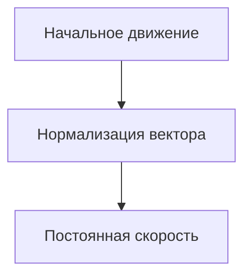

# Урок 1 - главный герой

## Игрок

### Создание игрока (передвижение на клавиатуре)

Начнем с создания игрока. Выбирайте `Другой узел`, чтобы выбрать любой другой узел в качестве корневого в сцене.


Основным узлом будет `CharacterBody2D` и к нему мы присоединяем `AnimatedSprite2D`, `Camera2D` и `CollisionShape2D`


>[!Tip]
>На скрине представлены параметры камеры. Вы можете воспользоваться ими, или же подобрать на свой вкус

#### Анимация

У спрайта создаем 3 анимации:
* Бездействие (лицом вниз)
* Идем вверх
* Идем вниз


Чтобы добавить кадр из спрайт-лист (это картинка с кучей кадров), нужно нажать на следующую кнопку:


Находите нужный спрайт-лист и настраиваете количество линий и выбираете необходимые кадры:


>[!Note]
>Сколько и какие кадры вставлять в анимацию разберетесь по ходу работы или можно посмотреть на гифке выше

Так же необходимо выставить смещение (`offset`). На картинке ниже пример, ваши значения могут отичаться. Выставляйте значение так чтобы низ персонажа был на одной линии с верхней линией viewport.


>[!Tip]
>В будщем это понадобиться для точго чтобы персонаж мог заходить за другие объекты.

#### Коллизия

Коллизию задаем у нижней части игрока, так как игра изометрическая.


>[!Tip]
>Помимо стандартных параметров вы можете использовать `Skew` и `Rotation`, в разделе `Transform`, у узла `CollisionShape2D`. Так вы сомжете придать коллизии форму как у шахатной фигуры.

#### Камера
Про камеру нужно поговорить чуть-чуть подробнее, если вы раньше особо не трогали её свойства.

- `Zoom` отвечает за приближение камеры к её центру
- `Position Smoothing` включает плавность камеры
- `Process Callback` изменяет поведение камеры. Чтобы камера не дёргалась в режимие `Position Smoothing` обязательно поставьте его в значение `Physics`

#### Скрипт игрока
Прикрепите скрипт к корневому узлу `CharacterBody2D`, который следует переименовать в `Player`. Рекомендуй детям называть узлы осмысленно и с большой буквы, без пробелов. Такой стиль наименования называется [CamelCase](https://ru.wikipedia.org/wiki/CamelCase).

Переходим к скрипту, изначально создаем переменную сокрости.

```gdscript
@export var speed = 100 # экспортируемая переменная, которая добавляется в инспектор узла к которому прикреплен скрипт.
```


>[!Tip]
>Сперва можешь задать лишь одно направление или максимум два. 

```gdscript
func _physics_process(delta):
	motion = Vector2() # мы изначально делаем motion равным нулю (допускается вариант Vector2.ZERO)
	if Input.is_action_pressed("up"): # нажимаем на W
		motion.y = -speed # уменьшаем Y с значением speed

  	set_velocity(speed) # Это нужно для того чтобы персонаж двигался и скорость не складывалась, если мы идем по диагонали
	move_and_slide() # Этот метод так же важен для перемещения игрока
```
Обязательно дайте возможность детям проявить себя и попробовать написать движение персонажа в другие стороны. Особенно можно похвалить тех, которые написали по-своему. Главнее, чтобы перемещение работало.

>Ссылки для подробного изучения работы методов [`set_velocity()`](https://docs.godotengine.org/en/4.3/classes/class_characterbody2d.html) и [`move_and_slide()`](https://docs.godotengine.org/en/4.3/classes/class_characterbody2d.html#class-characterbody2d-method-move-and-slide) 

И теперь задаем само передвижение + анимации
```gdscript
func _physics_process(delta):
	motion = Vector2() # мы изначально делаем motion равным нулю (допускается вариант Vector2.ZERO)
	if Input.is_action_pressed("up"): # нажимаем на W
		motion.y = -speed # уменьшаем Y с значением speed
		$AnimatedSprite2D.play("walk_up") # Анимация вверх
	if Input.is_action_pressed("right"): 
		motion.x = speed 
		$AnimatedSprite2D.flip_h = false # отключаем flip_h при движении вправо
		if $AnimatedSprite2D.animation == "idle_down": # это нужно, чтобы анимация не ломалась т.к. при движении вправо-влево ->
			$AnimatedSprite2D.play("walk_down") # ломается анимация и таким образом мы с анимации idle переключаемся на анимацию движения

	if Input.is_action_pressed("left"): # здесь вся та же история, но движение в другую сторону
		motion.x = -speed
		$AnimatedSprite2D.flip_h = true
		if $AnimatedSprite2D.animation == "idle_down":
			$AnimatedSprite2D.play("walk_down")

	if Input.is_action_pressed("down"):
		motion.y = speed
		$AnimatedSprite2D.play("walk_down")
	
	if motion == Vector2(): # если движение равно 0 по обоим векторам (можно Vector2.ZERO)
		$AnimatedSprite2D.play("idle_down") # то включается эта анимация

  	set_velocity(motion.normalized() * speed) # Это нужно для того чтобы скорость не складывалась если мы идем по диагонали
	move_and_slide()
```
>[!TIP]
>Хорошей практикой считается разделение обработчика анимаций и обработчика физики в разные методы. Анимации - в process(delta), а физику - в physics_process(delta). [Ссылка](https://docs.godotengine.org/en/stable/tutorials/scripting/idle_and_physics_processing.html) на официальную документацию. С хардами можно заморочиться и разделить управление и анимации на различные обработчики.

>Пример вопроса: Как вы думаете, почему стоит метод обработчика физики добавлять именно в `physics_process(delta)`?  

## Подробнее про нормализацию вектора
### Нормализация вектора движения

При разработке игр с управлением в реальном времени, особенно в изометрических играх, важно нормализовать векторы движения. Это позволяет сохранять постоянную скорость персонажа независимо от направления его движения.

#### Что такое нормализация вектора?

Вектор направления может иметь разную длину (величину), зависящую от направления движения. Чтобы персонаж всегда двигался с одинаковой скоростью, длина этого вектора должна быть равна 1. Процесс приведения длины вектора к единице называется **нормализацией**.

#### Пример

В контексте изометрической игры, где игрок может ходить влево, вправо, вверх и вниз, нормализация вектора движения выглядит следующим образом:

```gdscript
# motion - это вектор направления, заданный игроком
# speed - это скорость перемещения персонажа
set_velocity(motion.normalized() * speed)
```
`motion.normalized()` — нормализует вектор направления, чтобы его длина всегда была равна 1.
Умножение на `speed` гарантирует, что персонаж будет двигаться с постоянной скоростью независимо от того, движется ли он по диагонали или по одной оси.

Визуально выглядит как-то так: 


> [!TIP]
> Можно провести аналогию с экранным джойстиком в мобильных играх или на джойстике геймпада


> [!WARNING]
> Поскольку нормализация включает деление на длину вектора, нормализовать вектор с длиной 0 невозможно. Попытка сделать это обычно приведет к ошибке. Однако в GDScript вызов метода `normalized()` для вектора с длиной 0 оставит значение неизменным и предотвратит возникновение ошибки.

### Зачем это нужно?
Без нормализации персонаж будет двигаться быстрее при движении по диагонали, так как длина вектора движения по двум осям больше, чем по одной. Нормализация решает эту проблему, приводя вектор к единичной длине и обеспечивая равномерную скорость по всем направлениям.




<details>
	<summary>Сделайте ускорение, если много времени</summary>
	
Также можно добавить небольшое ускорение, можно такое как показано ниже

```gdscript
if Input.is_action_pressed("shift"):
		speed = 300
	else:
		speed = 200
```

А можно такой вариант с ограниченным временем действия

```gdscript
	if Input.is_action_pressed("run") and stamina > 5:
		speed = 80
		stamina -= 1
	else:
		speed = 50
		stamina += 1
		
	if stamina <= 6:
		speed = 50
```

Однако в таком случае нужно задать максимальное значение стамины и задать следующее условие

```gdscript
	if stamina > max_stamina:
		stamina = max_stamina
```
</details>


# Итоги урока
- Создали персонажа, который умеет заходить за здания, где его не будет видно
- Кто не знал что такое нормализация вектора - узнали, что это


# Допы

В случае, если у вас остается много времени или ученикам хочется реализовать что-то другое, то можете дать им следующий материал


