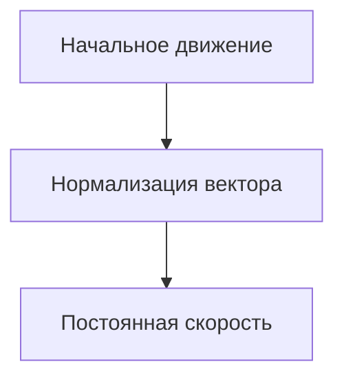

# 1 Урок (Квест)

## Краткое содержание
- Создание изометрической [карты](#карта) разного уровня сложности. С несколькими слоями - для хардов, с одним - для медиум и изиков.
- Создание [игрока](#игрок) с разными механиками
- [Допы](#допы)


## Карта

### Создание базового игрового поля

Создадим базовое поле, на котором уже будет добавлять все остальное, в нашем случае это будет зеленое поле. Для этого создаем `TileMap`. В свойствах `TileMap` создаем `TileSet` после чего у нас появится сетка игрового поля. Т.к. мы создаем изометрический проект, `TileSet` нам нужно настроить под изометрию. Для этого изменим следующие параметры `TileSet`. 


Добавим сам тайл травы и зададим его размер в максимально допустимое значение, в нашем случае размер будет равен 128х128

> поправь этот скрин, Эрель


Закрашиваем область в который мы будет дальше работать травой и переходим к созданию зданий. Сделать это быстро можно зажав <kbd>Ctrl</kbd>+<kbd>Shift</kbd> и левой кнопкой выделить обрасть заполнение. Выглядеть будет примерно так:


### Создание зданий

Прежде чем создавать здания поменяем рендеринг текстур, нужно нам это для того, чтобы картинки были не мыльными, а пиксельными


>[!NOTE]
>В Godot различие между режимами рендеринга `nearest` и `linear` связано с тем, как текстуры интерполируются при масштабировании или изменении их размера.

1. Nearest (ближайший):
   - Использует метод ближайшего соседа для интерполяции пикселей.
   - При увеличении текстуры, цвет каждого пикселя берется из ближайшего пикселя оригинальной текстуры.
   - Это приводит к более резким и четким границам, что может создавать "пикселизацию".
   - Хорошо подходит для 2D-игр с пиксельной графикой, где важна четкость и стиль.
2. Linear (линейный):
   - Использует линейную интерполяцию для сглаживания цветов между пикселями.
   - При увеличении текстуры происходит смешивание цветов соседних пикселей, что создает более плавные переходы.
   - Это может сделать текстуру более размытой, но также более реалистичной.
   - Подходит для 3D-графики и игр, где важна плавность и детализация.

Теперь для каждого здания нужно создать отдельную сцену родительским узлом которой будет `StaticBody2D`, а дочерними узлами будут `Sprite2D` и `CollisionPolygon2D`

Для `Sprite2D` используем текстурки зданий, а у `CollisionPolygon2D` задаем зону по которой не сможет ходить игрок, условно зону находящуюся под окнами первого этажа. Это нам позволит в будущем сделать эффект того, что игрок заходит за здание

Необходимо сместить `Sprite2D` при помощи свойства `offset`. Значения этих смещений будут указаны в скриншотах в таблице ниже

>[!IMPORTANT]
> Важно донести до учеников зачем им делать смещение спрайта. Так как сортировка идет по центру самого спрайта, а при обычном изменении `position` смещается и сам центр, нам нужно сдвинуть спрайт, не сдвигая сам центр спрайта. Поэтому мы смещаем его при помощи `offset`.

Примеры зданий:

| Название  | Скриншот | 
| ------------- | ------------- |
| Обычный дом   |  |
| Замок  |  | 
| Гостинница  |  | 
| Торговцы |  | 
| Таверна |  | 

Другие здания можете подобрать самостоятельно или дать эту работу ученикам. Если не выставить смещение (offset), то игрок будет некорректно заходить за здания и выставляться на передний план.
Теперь можно расставить эти здания по нашей карте, как делать это зависит от фантазии ученика, пример того как можно расставить ниже (для всех зданий нужно создать узел `Node2D` в котором будут хранится все здания и в будущем игрок и NPC)


### Создание дорожек

Для дорожек нам нужен еще один `TileMap` со следующими параметрами


Добавим тайл дорожки и зададим его размер примерно в такие значение, их можно подобрать по желанию ученика


В результате мы получим примерно следующее:


## Игрок

### Создание игрока (передвижение на клавиатуре)

Начнем создание игрока. Основным узлом будет `CharacterBody2D` и к нему мы присоединяем `AnimatedSprite2D`, `Camera2D` и `CollisionShape2D`


У спрайта создаем 3 анимации:
* Стоим и повернуты вниз
* Идем вверх
* Идем вниз

Коллизию задаем у нижней части игрока, так как игра изометрическая.


Переходим к скрипту, изначально создаем 2 переменные.

```gdscript
var motion = Vector2()
@export var speed = 200
```

И теперь задаем само передвижение + анимации
```gdscript
func _physics_process(delta):
	motion = Vector2() # мы изначально делаем motion равным нулю (допускается вариант Vector2.ZERO)
	if Input.is_action_pressed("up"): # нажимаем на W
		motion.y = -speed # уменьшаем Y с значением speed
		$AnimatedSprite2D.play("walk_up") # Анимация вверх
	if Input.is_action_pressed("right"): 
		motion.x = speed 
		$AnimatedSprite2D.flip_h = false # отключаем flip_h при движении вправо
		if $AnimatedSprite2D.animation == "idle_down": # это нужно, чтобы анимация не ломалась т.к. при движении вправо-влево ->
			$AnimatedSprite2D.play("walk_down") # ломается анимация и таким образом мы с анимации idle переключаемся на анимацию движения

	if Input.is_action_pressed("left"): # здесь вся та же история, но движение в другую сторону
		motion.x = -speed
		$AnimatedSprite2D.flip_h = true
		if $AnimatedSprite2D.animation == "idle_down":
			$AnimatedSprite2D.play("walk_down")

	if Input.is_action_pressed("down"):
		motion.y = speed
		$AnimatedSprite2D.play("walk_down")
	
	if motion == Vector2(): # если движение равно 0 по обоим векторам (можно Vector2.ZERO)
		$AnimatedSprite2D.play("idle_down") # то включается эта анимация

  	set_velocity(motion.normalized() * speed) # Это нужно для того чтобы скорость не складывалась если мы идем по диагонали
	move_and_slide()
```
>[!TIP]
>Хорошей практикой считается разделение обработчика анимаций и обработчика физики в разные методы. Анимации - в process(delta), а физику - в physics_process(delta). [Ссылка](https://docs.godotengine.org/en/stable/tutorials/scripting/idle_and_physics_processing.html) на официальную документацию. С хардами можно заморочиться и разделить управление и анимации на различные обработчики.

>Пример вопроса: Как вы думаете, почему стоит метод обработчика физики добавлять именно в `physics_process(delta)`?  

## Подробнее про нормализацию вектора
### Нормализация вектора движения

При разработке игр с управлением в реальном времени, особенно в изометрических играх, важно нормализовать векторы движения. Это позволяет сохранять постоянную скорость персонажа независимо от направления его движения.

#### Что такое нормализация вектора?

Вектор направления может иметь разную длину (величину), зависящую от направления движения. Чтобы персонаж всегда двигался с одинаковой скоростью, длина этого вектора должна быть равна 1. Процесс приведения длины вектора к единице называется **нормализацией**.

#### Пример

В контексте изометрической игры, где игрок может ходить влево, вправо, вверх и вниз, нормализация вектора движения выглядит следующим образом:

```gdscript
# motion - это вектор направления, заданный игроком
# speed - это скорость перемещения персонажа
set_velocity(motion.normalized() * speed)
```
`motion.normalized()` — нормализует вектор направления, чтобы его длина всегда была равна 1.
Умножение на `speed` гарантирует, что персонаж будет двигаться с постоянной скоростью независимо от того, движется ли он по диагонали или по одной оси.

Визуально выглядит как-то так: 


> [!TIP]
> Можно провести аналогию с экранным джойстиком в мобильных играх или на джойстике геймпада


> [!WARNING]
> Поскольку нормализация включает деление на длину вектора, нормализовать вектор с длиной 0 невозможно. Попытка сделать это обычно приведет к ошибке. Однако в GDScript вызов метода `normalized()` для вектора с длиной 0 оставит значение неизменным и предотвратит возникновение ошибки.

### Зачем это нужно?
Без нормализации персонаж будет двигаться быстрее при движении по диагонали, так как длина вектора движения по двум осям больше, чем по одной. Нормализация решает эту проблему, приводя вектор к единичной длине и обеспечивая равномерную скорость по всем направлениям.




<details>
	<summary>Сделайте ускорение, если много времени</summary>
	
Также можно добавить небольшое ускорение, можно такое как показано ниже

```gdscript
if Input.is_action_pressed("shift"):
		speed = 300
	else:
		speed = 200
```

А можно такой вариант с ограниченным временем действия

```gdscript
	if Input.is_action_pressed("run") and stamina > 5:
		speed = 80
		stamina -= 1
	else:
		speed = 50
		stamina += 1
		
	if stamina <= 6:
		speed = 50
```

Однако в таком случае нужно задать максимальное значение стамины и задать следующее условие

```gdscript
	if stamina > max_stamina:
		stamina = max_stamina
```
</details>

Необходимо добавить навигационный слой, добавив элемент


Затем выбрать слой навигации в свойствах рисования Набора Тайлов


</details>

Теперь для корректного отображения игрока проходящего рядом со зданиями включим следующий параметр у Node2D в котором всё хранится


Это позволит создать эффект того, что игрок заходит за здание


# Допы

В случае, если у вас остается много времени или ученикам хочется реализовать что-то другое, то можете дать им следующий материал

<details>

	
<summary>Можно сделать управление мышкой</summary>

 
```gdscript
var speed = 100
var stop = Vector2()

func _physics_process(delta):
	var agent = $NavigationAgent2D2
	var next = agent.get_next_path_position()
	agent.target_position = stop
	velocity = position.direction_to(next)*speed
	
	if not agent.is_navigation_finished():
		#update_animation(velocity)
		move_and_slide()
	#else:
		#animated_sprite.play("idle_down")
		
func _input(event):
	if InputEventMouseButton and event.is_pressed():
		stop = get_global_mouse_position()
```
Анимашки

```gdscript
@onready var animated_sprite = $AnimatedSprite2D

func update_animation(velocity):
	if velocity.x > 0:
		animated_sprite.flip_h = false
		animated_sprite.play("walk_down")
	elif velocity.x < 0:
		animated_sprite.flip_h = true
		animated_sprite.play("walk_down")
	elif velocity.y < 0:
		animated_sprite.play("walk_down")
	elif velocity.y > 0:
		animated_sprite.play("walk_down")
 ```

Игроку, который управляется через мышь необходимо добавить узел `NavigationAgent2D`

## Карта, если делаем управление игроком через мышь

Но тогда для управления игроком необходимо сделать навигационный слой для `TileMapLayer`


После того, как вы добавите слой - заходите в `Набор тайлов` внизу посередине и делаете следующее:
1. Выставляете образ будущей коллизии слева, расставляете вершины коллизии
2. С помощью ЛКМ выделяете все тайлы, где нужна эта коллизия


