# Вводный модуль 1 урок

Привет! Если ты искал / искала методичку по первому уроку вводного модуля python. То тогда ты по адресу!

## Содержание

- [Знакомство 10 минут](#знакомство-10-минут)
  - [Если ученик опоздал:](#если-ученик-опоздал)
- [Демонстрация и проверка](#демонстрация-игры-и-проверка)
- [Создание проекта](#создание-проекта)
- [Первые шаги](#первые-шаги)
  - [Импорт файлов](#импорт-файлов-в-проект)
  - [Персонаж и фон](#персонаж-и-фон)
    - [Фон](#фон)
    - [Персонаж](#персонаж)
- [Код](#код)
  - [Базовые функции](#базовые-функции)
  - [Гравитация](#гравитация)
  - [Полёт](#полёт)
- [Итоги](#итоги)
- [Допы](#допы)
<!-- [1]: #знакомство-10-минут -->

## <u>Знакомство 10 минут</u>

Начинать стоит с знакомства с твоими новыми учениками. Будь первым, расскажи о себе.\
Если не знаешь с чего начать попробуй ответить на эти вопросы:

1. Кто ты? (Преподаватель в школе IT компот)
2. Что ты будешь делать? (Учить создавать игры)
3. Чем ты увлекаешься? (Музыка, видео игры, вышивание и т.д.)

Отлично! Теперь попроси каждого из своих учеников представиться и рассказать о себе.\
Не стесняйся задавать им адресные вопросы:

1. Чем ты увлекаешься?
2. В какие игры играешь?
3. Какую игру хотел/хотела бы сделать?
4. Что уже успел/успела попрограммировать

>[!TIP]
> Это поможет отыскать подход к ученикам и использовать информацию о них на уроке, а так же позволит повысить уровень комфорта на уроке.

### Если ученик опоздал:

Если ученик опоздал на урок, обязательно поприветствовать. Задать пару простых впросов ("Сколько лет?", "Где живёшь?", "Опыт программирования?"). Ученика необходимо влить в группу! \

>[!TIP]
>Можно в 2-х словах рассказать чем сейчас все занимаются, по возможности дать задание всей группе и догнать с опоздавшим. Либо дать задание опоздавшему (скачать файлы, скачать движок если у него его нет).

>[!WARNING]
> Если ученик опоздал значительно (дети уже выставили на сцену фон и персонажа), лучше попросить админа отпустить ученика.

## Демонстрация игры и проверка

Чтобы ученики понимали что их ждёт обязательно покажите готовый вариант игры и объясните особенности геймплея.\
По сути мы делаем свою интерпретацию игры `Flappy Bird`

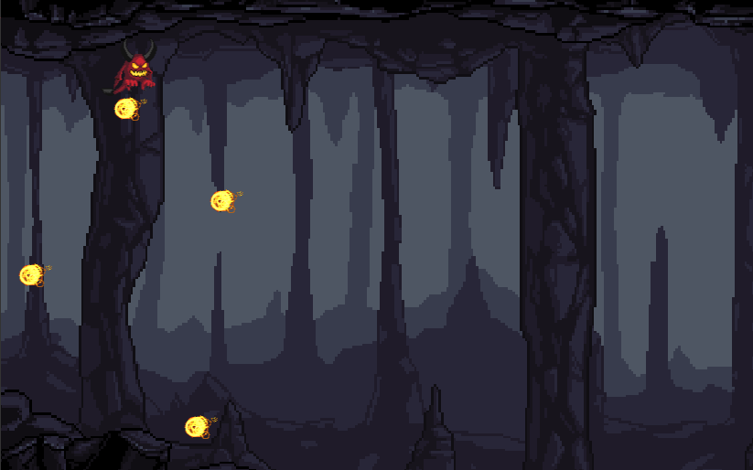

Перед началом обязательно проверь на демонстрации каждого ученика правильная ли версия движка у него стоит! В случае если нет. Необходимо установить актуальную версию.

>[!IMPORTANT]
> Все уроки первого года ведём 3.x.x версии! **[актуальная версия движка](https://godotengine.org/download/3.x/windows/)**

## Создание проекта

Запускаем движок, в появившемся всплывающем окне жмём `отмена`\
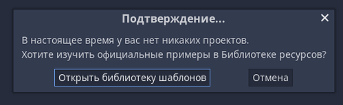

Следующим шагом будет нажать на кнопку `Новый проект` и придумать название вашего проекта.
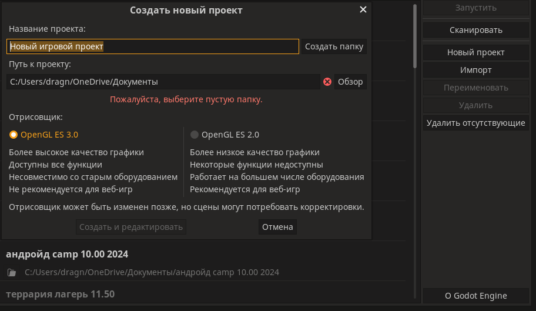

> Дайте ученикам самим придумать названия своих проектов, но следите за цензурой. Оскорбления в любом виде (даже субъективно мягком) недопустимы.

После того как назвали, нажимаем создать папку и попадаем в движок. На этом этапе убедитесь, что каждый ученик нажал на кнопку `2D сцена`

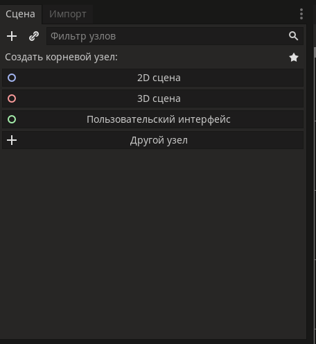

У учеников должен появиться узел `Node2D`. Если у кого-то не получилось исправляем.
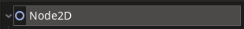

## Первые шаги

### Импорт файлов в проект

Отправляем ученикам [архив](сюда-ссылку-на-файлы) с файлами для первого урока.

Как только ученики скачают файлы просим их открыть архивы.

> В Godot нельзя перекинуть сразу архив, перед этим его необходимо распаковать.

Есть множество вариантов импорта. Я покажу самый удобный, на мой взгляд.

Показываем ученикам раздел `Файловая система` в движке. Ищем там папку `res://`.\
Объясняем, что там будут хранится все файлы проекта (модельки, звуки и т.д.)

Нажимаем `правой кнопкой мыши` на `res://` и выбираем `открыть в проводнике`
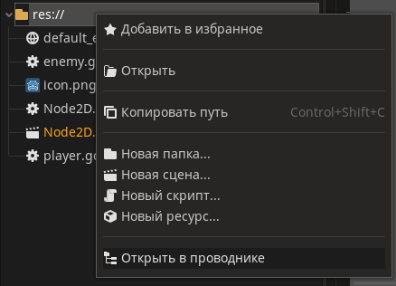

В открывшуюся папку перетаскиваем файлы для игры из архива и возвращаемся в движок.
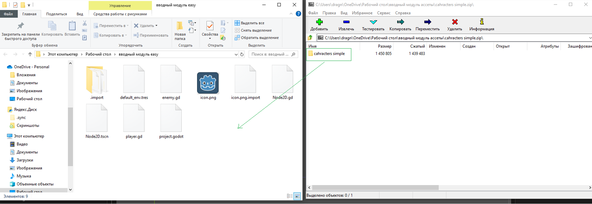

### Персонаж и фон

#### Фон

Показываю ученикам `файловую систему`. Даём возможность самостоятельно выбрать для себя фон.\
И показываем как растянуть по всей видимой области игры.
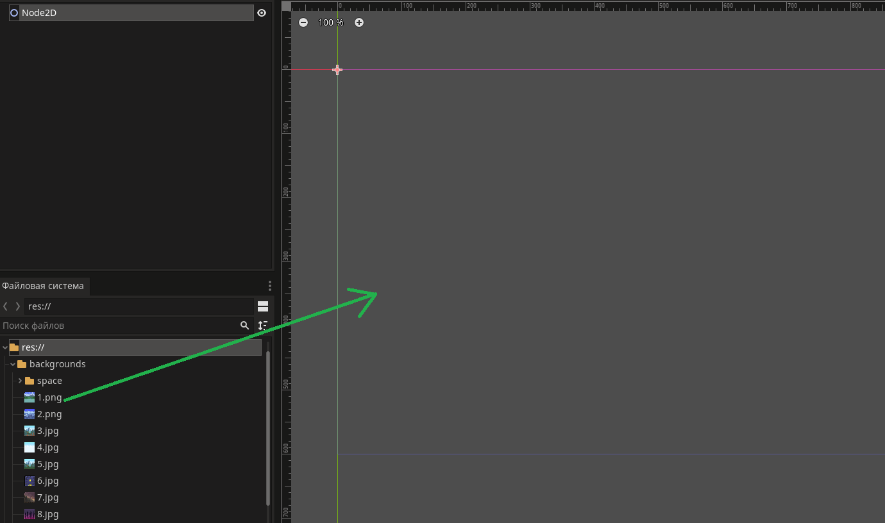

После этого обязательно сохраняем проект `ctrl + s`.\
Либо сверху слева находим раздел `сцена`, нажимаем и ищем `сохранить сцену`.

После этого запускаем игру `F5` или клавишей справа сверху и смотрим, что вышло.

#### Персонаж

В фильтре узлов, находим узел `Node2D` нажимаем по нему и слева вверху ищем знак `+`. \
Ищем узел `KinematicBody2D` и добавляем его на сцену.\


Объясняем в 2-х словах, что это специальный узел для двигающихся тел (персонажей, препятствий и т.д.).

> Даём ученикам возможность переименовать узел с персонажем самостоятельно, следите за цензурой.

Следующим шагом даём выбрать персонажа из огромного количества в файлах. И предлагаем перенести точно так же на сцену из `файловой системы`.

Проверьте чтобы у каждого ученика `спрайт` был прикреплён к узлу `KinematicBody2D`.
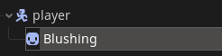

Далее выбираем в фильтре узлов `спрайт`. И показываем в `Инспеторе` раздел `Transform`.\
Объясняем, на примерах, что позиция `спрайта` должна быть точно такой же как и у `KinematicBody2D`.

Сбрасываем позицию `спрайта` и группируем объекты при помощи кнопки на панели инструментов 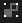.\
Дальше ученики могут поставить персонажа где нравится.

> Если нужно отразить `спрайт`. Установите свойство `scale` по оси `x` в значение `-1`

> Если при изменении масштаба персонажа начинает крючить и он становится как я после 8 - го урока. То можно
> переимпортировать изображение выбрав пресет `2D пиксели`.

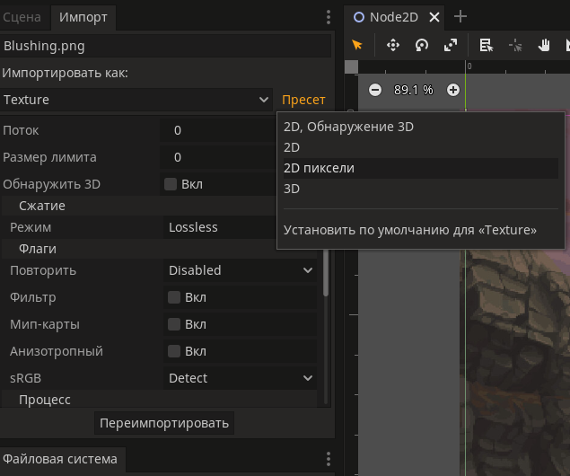

## Код

#### Базовые функции

Начинаем с функций `_ready()` и `_physics_process(delta)`\

Объясняем, что `_ready()` срабатывает один раз и спрашиваем где это можно использовать.\
Самый базовый пример - генерация мира в майнкрафт или террарии.

```GDScript
func _ready():
	print("Игра началась")
```

В отличии от `_ready()`, `_physics_process(delta)` работает пока её не остановишь принудительно.\
Срабатывает она 60 раз в секунду.

```GDScript
func _physics_process(delta):
	print("Игра идёт")
```

Можно рассказать про `delta` - время смены одного кадра на другой.

```GDScript
func _physics_process(delta):
#	print(delta)
	print(1/delta) # Покажет количество кадров в выводе.
```

#### Гравитация

У персонажа должна быть гравитация. Тут можно рассказать про константу g = 9.8.

> Хорошая возможность подметить, что физика которую изучают или будут изучать в школе, пригодится и в программировании.

Я объясняю на простом примере с арбузом падающим с большой высоты, но вы можете придумать свои.\
Обязательно поделись своим примером с остальными :з

Внутри функции `_physics_process(delta)` вызываем функцию `move_and_slide()`.

> `move_and_slide()` - Перемещает тело вдоль вектора. Если тело столкнется с другим телом, оно будет скользить вдоль него, а не остановится сразу. Если другое тело является KinematicBody2D или RigidBody2D, на него также будет влиять движение другого тела. Это можно использовать для создания движущихся и вращающихся платформ или для того, чтобы узлы толкали другие узлы.

Тут хорошо будет объяснить, что вообще такое `вектор` и чем он отличается от `отрезка`. Отлично будет показать в рисунках.

> Уточнить знакомы ли ребята с осями. И рассказать почему положитльеный `y`, направлен вниз и отличается от математики (в математике вверх `y`). И картинку! добавить. 

Говорим, что в движке есть специальный класс `Vector2()`, который позволяет задавать вектора и позицию используя оси `x` и `y`.

Итоговый код будет выглядеть так:

```GDScript
func _physics_process(delta):
	move_and_slide(Vector2(0, 9.8))
```

Запускаем и видим, что персонаж неловко опускается вниз с одной и тоже скоростью.\
Спрашиваем как можно исправить. Наводим на мысль, что каждую секунду `9.8` возрастает на `9.8`. Вспоминая про предыдущее объяснение `g`.

Тут отличная возможность ввести переменные. Cоздаём переменную `velocity`.

> `velocity` - векторная скорость. Она же векторная физическая величина, характеризующая быстроту перемещения и направление движения материальной точки относительно выбранной системы отсчёта.

```GDScript
var velocity = Vector2(0, 9.8)
```

Объясняем на простых примерах, что переменные нужны для хранения значений (можно сравнить с коробками).

Дописываем логику гравитации и проверяем:

```GDScript
var velocity = Vector2(0, 9.8)


func _physics_process(delta):
	velocity.y = velocity.y + 9.8 # сокращённый вариант даём только хардам
	move_and_slide(velocity)
```

#### Полёт

Спрашиваем как управлять персонажем? После вариантов ответов идём задавать кнопки.

Открываем слева сверху `проект`. В выпадающем меню выбираем `настройки проекта`.
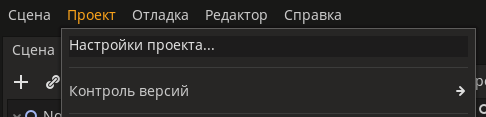

Во вкладе `Список действий` задаём новое действие и нажимаем на кнопку `добавить`.
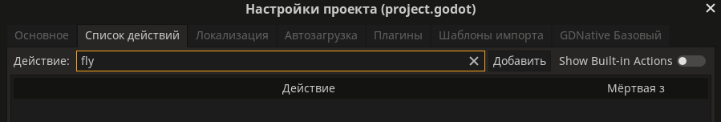

Находим справа от нового действия `+` и нажав на него выбираем `Клавиша`
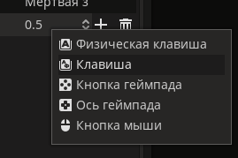

И даём ученикам выбрать любую кнопку для полёта.
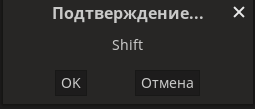

Останется только написать условие полёта. Тут я обычно просто спрашиваю как будет "если" по английски.

Собственно сам код с условием:

```GDScript
var velocity = Vector2(0, 9.8)


func _physics_process(delta):
	velocity.y = velocity.y + 9.8 # сокращённый вариант даём только хардам

	if Input.is_action_just_pressed("fly"):
		velocity = -400

	move_and_slide(velocity)
```

> Это логическая точка перового урока. Дальше код не пишем! Если осталось много времени делаем допы.

## Подведение итогов

В конце урока обязательно подвести итоги:

- Задать каждому ученику по одному вопросу по коду
- Спросить каждого, что было самым интересным
- Показать слайды из 1 и 2 из [презентации](ссылка-на-презу) (вставить задел на следующий урок)
- Отправить анкету обратной связи

## Допы:

1. Код рефакторинг (например вынести прыжок и гравитацию в отдельные переменные), объяснить зачем, на примере.
2. Делаем анимации через анимэйтед спрайт.
3. Показываем узел ParallaxLayer (если много времени осталось)
   или VideoPlayer (если времени мало), в файлах будут зарание готовые видео нужного формата.
4. Задать каждому ученику минимум по 1-му вопросу по коду или узлам и помочь найти ответ в случае затруднений. Так же спросить у каждого, что больше всего понравилось делать на уроке.
5. Партиклы
