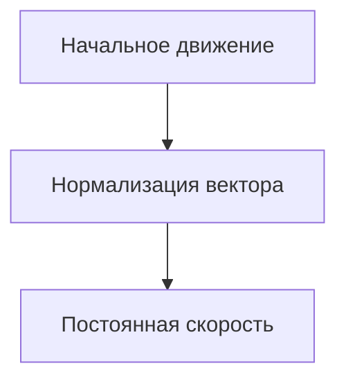

# Quest
Проект, направлен на отработку тем, изученных на предыдущих уроках. В ходе создания игры ученики закрепят концепции объектно-ориентированного программирования (ООП) и научатся применять их на практике.

## Цели
- Поработать над генерацией объектов на сцене
- Освоить уже полноценно циклы (ребята по итогу должны по аналогии сами сделать часть кода)
- Это последний проект в 1 году обучения, соответственно ребята показывают свой максимум приобретенных знаний

## Краткое содержание
- Урок 1 - [Карта, игрок](#урок-1)
- Урок 2 - [Боты](#урок-2)
- Урок 3 - (Квест)
- Урок 4 - (Доработка квеста)
- Урок 5 - 
- Урок 6 - 
- Урок 7 - 
- Урок 8 - 

## Урок 1 

## Карта

### Создание базового игрового поля

Создадим базовое поле, на котором уже будет добавлять все остальное, в нашем случае это будет зеленое поле. Для этого создаем `TileMap`. В свойствах `TileMap` создаем `TileSet` после чего у нас появится сетка игрового поля. Т.к. мы создаем изометрический проект, `TileSet` нам нужно настроить под изометрию. Для этого изменим следующие параметры `TileSet`. 


Добавим сам тайл травы и зададим его размер в максимально допустимое значение, в нашем случае размер будет равен 128х128


Закрашиваем область в который мы будет дальше работать травой и переходим к созданию зданий. Сделать это быстро можно зажав <kbd>Ctrl</kbd>+<kbd>Shift</kbd> и левой кнопкой выделить обрасть заполнение. Выглядеть будет примерно так:


### Создание зданий

Прежде чем создавать здания поменяем рендеринг текстур, нужно нам это для того, чтобы картинки были не мыльными, а пиксельными


Теперь для каждого здания нужно создать отдельную сцену родительским узлом которой будет `StaticBody2D`, а дочерними узлами будут `Sprite2D` и `CollisionPolygon2D`

Для `Sprite2D` используем текстурки зданий, а у `CollisionPolygon2D` задаем зону по которой не сможет ходить игрок, условно зону находящуюся под окнами первого этажа. Это нам позволит в будущем сделать эффект того, что игрок заходит за здание

Необходимо сместить `Sprite2D` при помощи свойства `offset`. Значения этих смещений будут указаны в скриншотах в таблице ниже

>[!IMPORTANT]
> Важно донести до учеников зачем им делать смещение спрайта. Так как сортировка идет по центру самого спрайта, а при обычном изменении `position` смещается и сам центр, нам нужно сдвинуть спрайт, не сдвигая сам центр спрайта. Поэтому мы смещаем его при помощи `offset`.

Примеры зданий:

| Название  | Скриншот | 
| ------------- | ------------- |
| Обычный дом   |  |
| Замок  |  | 
| Гостинница  |  | 
| Торговцы |  | 
| Таверна |  | 

Другие здания можете подобрать самостоятельно или дать эту работу ученикам. Если не выставить смещение (offset), то игрок будет некорректно заходить за здания и выставляться на передний план.
Теперь можно расставить эти здания по нашей карте, как делать это зависит от фантазии ученика, пример того как можно расставить ниже (для всех зданий нужно создать узел Node2D в котором будут хранится все здания и в будущем игрок и NPC)


### Создание дорожек

Для дорожек нам нужен еще один `TileMap` со следующими параметрами


Добавим тайл дорожки и зададим его размер примерно в такие значение, их можно подобрать по желанию ученика


В результате мы получим примерно следующее:


## Игрок

### Создание игрока (передвижение на клавиатуре)

Начнем создание игрока. Основным узлом будет `CharacterBody2D` и к нему мы присоединяем `AnimatedSprite2D`, `Camera2D` и `CollisionShape2D`


У спрайта создаем 3 анимации:
* Стоим и повернуты вниз
* Идем вверх
* Идем вниз

Коллизию задаем у нижней части игрока, так как игра изометрическая.


Переходим к скрипту, изначально создаем 2 переменные.

```gdscript
var motion = Vector2()
@export var speed = 200
```

И теперь задаем само передвижение + анимации
```gdscript
func _physics_process(delta):
	motion = Vector2() # мы изначально делаем motion равным нулю (допускается вариант Vector2.ZERO)
	if Input.is_action_pressed("up"): # нажимаем на W
		motion.y = -speed # уменьшаем Y с значением speed
		$AnimatedSprite2D.play("walk_up") # Анимация вверх
	if Input.is_action_pressed("right"): 
		motion.x = speed 
		$AnimatedSprite2D.flip_h = false # отключаем flip_h при движении вправо
		if $AnimatedSprite2D.animation == "idle_down": # это нужно, чтобы анимация не ломалась т.к. при движении вправо-влево ->
			$AnimatedSprite2D.play("walk_down") # ломается анимация и таким образом мы с анимации idle переключаемся на анимацию движения

	if Input.is_action_pressed("left"): # здесь вся та же история, но движение в другую сторону
		motion.x = -speed
		$AnimatedSprite2D.flip_h = true
		if $AnimatedSprite2D.animation == "idle_down":
			$AnimatedSprite2D.play("walk_down")

	if Input.is_action_pressed("down"):
		motion.y = speed
		$AnimatedSprite2D.play("walk_down")
	
	if motion == Vector2(): # если движение равно 0 по обоим векторам (можно Vector2.ZERO)
		$AnimatedSprite2D.play("idle_down") # то включается эта анимация

  	set_velocity(motion.normalized() * speed) # Это нужно для того чтобы скорость не складывалась если мы идем по диагонали
	move_and_slide()
```
>[!TIP]
>Хорошей практикой считается разделение обработчика анимаций и обработчика физики в разные методы. Анимации - в process(delta), а физику - в physics_process(delta). [Ссылка](https://docs.godotengine.org/en/stable/tutorials/scripting/idle_and_physics_processing.html) на официальную документацию 

## Подробнее про нормализацию вектора
### Нормализация вектора движения

При разработке игр с управлением в реальном времени, особенно в изометрических играх, важно нормализовать векторы движения. Это позволяет сохранять постоянную скорость персонажа независимо от направления его движения.

#### Что такое нормализация вектора?

Вектор направления может иметь разную длину (величину), зависящую от направления движения. Чтобы персонаж всегда двигался с одинаковой скоростью, длина этого вектора должна быть равна 1. Процесс приведения длины вектора к единице называется **нормализацией**.

#### Пример

В контексте изометрической игры, где игрок может ходить влево, вправо, вверх и вниз, нормализация вектора движения выглядит следующим образом:

```gdscript
# motion - это вектор направления, заданный игроком
# speed - это скорость перемещения персонажа
set_velocity(motion.normalized() * speed)
```
`motion.normalized()` — нормализует вектор направления, чтобы его длина всегда была равна 1.
Умножение на `speed` гарантирует, что персонаж будет двигаться с постоянной скоростью независимо от того, движется ли он по диагонали или по одной оси.

Визуально выглядит как-то так: 


> [!TIP]
> Можно провести аналогию с экранным джойстиком в мобильных играх или на джойстике геймпада


> [!WARNING]
> Поскольку нормализация включает деление на длину вектора, нормализовать вектор с длиной 0 невозможно. Попытка сделать это обычно приведет к ошибке. Однако в GDScript вызов метода `normalized()` для вектора с длиной 0 оставит значение неизменным и предотвратит возникновение ошибки.

### Зачем это нужно?
Без нормализации персонаж будет двигаться быстрее при движении по диагонали, так как длина вектора движения по двум осям больше, чем по одной. Нормализация решает эту проблему, приводя вектор к единичной длине и обеспечивая равномерную скорость по всем направлениям.




<details>
	<summary>Сделайте ускорение, если много времени</summary>
	
Также можно добавить небольшое ускорение, можно такое как показано ниже

```gdscript
if Input.is_action_pressed("shift"):
		speed = 300
	else:
		speed = 200
```

А можно такой вариант с ограниченным временем действия

```gdscript
	if Input.is_action_pressed("run") and stamina > 5:
		speed = 80
		stamina -= 1
	else:
		speed = 50
		stamina += 1
		
	if stamina <= 6:
		speed = 50
```

Однако в таком случае нужно задать максимальное значение стамины и задать следующее условие

```gdscript
	if stamina > max_stamina:
		stamina = max_stamina
```
</details>

## Второй вариант игрока (через мышь)

<details>

	
<summary>Можно сделать управление мышкой</summary>

 
```gdscript
var speed = 100
var stop = Vector2()

func _physics_process(delta):
	var agent = $NavigationAgent2D2
	var next = agent.get_next_path_position()
	agent.target_position = stop
	velocity = position.direction_to(next)*speed
	
	if not agent.is_navigation_finished():
		#update_animation(velocity)
		move_and_slide()
	#else:
		#animated_sprite.play("idle_down")
		
func _input(event):
	if InputEventMouseButton and event.is_pressed():
		stop = get_global_mouse_position()
```
Анимашки

```gdscript
@onready var animated_sprite = $AnimatedSprite2D

func update_animation(velocity):
	if velocity.x > 0:
		animated_sprite.flip_h = false
		animated_sprite.play("walk_down")
	elif velocity.x < 0:
		animated_sprite.flip_h = true
		animated_sprite.play("walk_down")
	elif velocity.y < 0:
		animated_sprite.play("walk_down")
	elif velocity.y > 0:
		animated_sprite.play("walk_down")
 ```

Игроку, который управляется через мышь необходимо добавить узел `NavigationAgent2D`

## Карта, если делаем управление игроком через мышь

Но тогда для управления игроком необходимо сделать навигационный слой для `TileMapLayer`


Необходимо добавить навигационный слой, добавив элемент


Затем выбрать слой навигации в свойствах рисования Набора Тайлов


</details>

Теперь для корректного отображения игрока проходящего рядом со зданиями включим следующий параметр у Node2D в котором всё хранится


Это позволит создать эффект того, что игрок заходит за здание


## Урок 2

### Обычный бот

На этом уроке мы создадим самого обычного NPC (Non-player character) не дающего заданий. Основным узлом будет `CharacterBody2D` и к нему мы присоединяем `AnimatedSprite2D` и `CollisionShape2D`. Анимации и коллизию делаем как у игрока полсе чего переходим к скрипту.
А так же создаим бота, который будет выдавать задания игроку


> Как можно заметить - у ботов похожий спрайт, следовательно, то же самое смещение

Для реализации нам понадобятится 4 переменные

```gdscript
var move_dir = Vector2.ZERO
var move_speed = 50
var time_to_change_dir = 2
var timer = 0
```

После чего в process прописываем случайное перемещение бота каждые 2 секунды

```gdscript
func _process(delta):
	timer += delta;
	if timer >= time_to_change_dir:
		timer = 0
		move_dir = Vector2(randf_range(-1, 1), randf_range(-1, 1)).normalized()

	if move_dir == Vector2(0,0):
		$AnimatedSprite2D.play("idle")
	else:
		move_anim()
	
	set_velocity(move_dir * move_speed)
	move_and_slide()

func move_anim():
	if move_dir.x > 0:
		$AnimatedSprite2D.flip_h = false
	else:
		$AnimatedSprite2D.flip_h = true
		
	if move_dir.y > 0:
		$AnimatedSprite2D.play("walk_dwn")
	else:
		$AnimatedSprite2D.play("walk_up")
```

На уровне добавляем отдельный узел Node2D где будут хранится все NPC, после чего присоединяем туда наших ботов.


> Как видно, `Ordering`, а точнее свойство `Y Sort Enabled` - включен. Поэтому будет работать сортировка по Y у всех дочерних элементов 

## Квестодатель

Следующий подраздел начнем с создания персонажа у которого мы можем получить квест. К NPC добавим его анимацию, например так:


>[!NOTE]
>Дети уже к концу курса должны быть на опыте, поэтому можно спокойно отдать часть с настройкой анимации на самостоятельную реализацию.
>Коллизии лучше сделать с ними, так как их настройка будет зависеть от расположения этого персонажа

Используем мы `CollisionPolygon2D` потому что через него можно задать необходимую область для персонажа, но если ребенок совсем Easy, то можно сделать `CollisionShape2D`. 

Теперь нам нужно создать сам диалог с продавцом, для этого создадим `CanvasLayer` и в нем узел `Control`.


>[!TIP]
>Для удобства привыкайте переименовывать узлы, чтобы было понятнее и проще работать с ними в будущем.


Также нам понадобятся следующие элементы:
* `Panel` x2 (рамка диалогового окна и рамка текста)
* `RichTextLabel` (Текст самого NPC)
* `Button` x2 (Выбор питомца)
* `AnimatedSprite2D` (Скин NPC)

И приходим примерно к этому:


>[!NOTE]
>Конечно вы можете сделать свой вариант. И дети тоже могут. Проявите свою творческую сторону!


>Такой вариант может быть даже лучше, сэкономит место, но вы в любом случае можете выбрать сами.

Добавим появление этого диалога с торговцем. Для этого создадим зону с коллизией


Присоединяем сигналы на вход и выход из зоны торговца и в них прописываем включение/выключение диалога соответственно

```gdscript
var in_area = false

func _on_torgovec_body_entered(body):
	if body.name == "Player":
		in_area = true
		if in_area == true:
			$CanvasLayer/torgovec_dialog.visible = true


func _on_torgovec_body_exited(body):
	if body.name == "Player":
		in_area = false
		if in_area == false:
			$CanvasLayer/torgovec_dialog.visible = false
```


Можно добавить проверку на диалог, чтобы маршрут не строился в случае диалога. Для этого создаем глобальный скрипт и добавляем изменение в зависимости от ситуации.

Если мы зашли в зону диалога делаем переменную true

```gdscript
func _on_area_2d_body_entered(body):
	if body.name == "player":
		in_area = true
		if in_area == true:
			GlobalScript.dialog = true
			$"../../CanvasLayer/Pet_tailor".visible = true
```

А если мы нажали по выбору питомца или он уже у нас есть мы делаем ее false

```gdscript
func _on_wolf_2_pressed():
	if pet_count < 1:
		var pet = pet_bear.instantiate()
		pet_count += 1
		pet.position = $".".position
		get_parent().add_child(pet)
		$"../../CanvasLayer/Pet_tailor/RichTextLabel".text = "Ну слушай... Зато к тебе и близко никто не подойдет"
		GlobalScript.dialog = false
	else:
		$"../../CanvasLayer/Pet_tailor/RichTextLabel".text = "У тебя уже есть питомец"
		GlobalScript.dialog = false
```

Следующего NPC которого мы сделаем будет стражник который рассказывает что где находится. Нам понадобятся следующие узлы:
* `Area2D`
* `AnimatedSprite2D`
* `CollisionShape2D`
* `Label`

MPC будет выглядить примерно так


Теперь нам нужно сздать сам диалог со стражником. Делать это мы будем в ранее созданном `CanvasLayer`. Основным узлом бьудет `Control` и к нему присоединяем следующие узлы:
* `Panel` х2
* `RichTextLabel`
* `Button` x4

Расставляем все и создаем скрипт у Control после чего присоединяем сигналы к кнопкам.


```gdscript
var variation_fact = 0


func _on_answer1_pressed():
	$RichTextLabel.text = "Просто иди дальше по дороге. Не ошибешься. Они полказны угрохали на этот замок."


func _on_answer2_pressed():
	$RichTextLabel.text = "Парень, она слева от тебя."


func _on_answer3_pressed():
	randomize()
	variation_fact = int(randf_range(0, 10))
	if variation_fact == 0:
		$RichTextLabel.text = "Что-то интересное? Я тебе что, библиотекарь что ли?"
	if variation_fact == 1:
		$RichTextLabel.text = "Говорят в городе завелся некий Давахин... Ничего не слышал об этом?"
	if variation_fact == 2:
		$RichTextLabel.text = "Хочешь что-то интересное - дуй в таверну. Там наслушаешься"
	if variation_fact == 3:
		$RichTextLabel.text = "Ты никому не говори, но я на самом деле хотел быть в разведотряде."
	if variation_fact == 4:
		$RichTextLabel.text = "А что если я тоже избранный? Я вон, в детстве в чан с облепиховым морсом упал."
	if variation_fact == 5:
		$RichTextLabel.text = "Если ты слышал местные слухи о слуге, который убил своего хозяина и стал стражником, то это не я"

func _on_answer4_pressed():
	$RichTextLabel.text = "Ага. Всего хорошего."
```

Теперь нужно добавить собственно появление этого диалога. Для этого создаем скрипт у Area2D нашего NPC

```gdscript
func _on_guard_body_entered(body):
	if body.name == "Player":
		$Label.visible = true
		$Label.text = "Чего тебе, приключенец?"
		$"../../CanvasLayer/dialog".visible = true
		
	if body.is_in_group("NPC"):
		$Label.visible = true
		$Label.text = "Не мешайте службе, житель"

func _on_guard_body_exited(body):
	if body.name == "Player":
		$Label.visible = false
		$"../../CanvasLayer/dialog".visible = false
		
	if body.is_in_group("NPC"):
		$Label.visible = false
```

## Урок 3

Этот урок мы начнем с создания NPC который будет выдавать нам задание найти объект. Структура NPC следующая


Создаем скрипт у Area2D и создаем следующие переменные

```gdscript
var task = 0;
var task_accept = false
```

Сначала добавим появлени и исчезновение диалога с NPC при входе в зону

```gdscript
func _on_guild_of_heroes_body_entered(body):
	if body.name == "Player":
		$Label_quest.visible = true
		$Button.visible = true

func _on_guild_of_heroes_body_exited(body):
	if body.name == "Player":
		$Label_quest.visible = false
		$Button.visible = false
```

В ранее созданном глобальном скрипте доьбавим список в который мы будем добавлять и удалять задания


```gdscript
var tasks = []

func add_task(task):
	tasks.append(task)

func remove_task(task):
	tasks.erase(task)
```

Также нам нужно создать само яблоко, оно состоит из следующих узлов


Еще можно создать список текущих квестов, по сути это просто Label в который мы будем вносить текст


Возвращаемся к скрипту зоны. Присоединяем сигнал к кнопке 

```gdscript
func _on_Button_pressed():
	task_accept = true
	$Label_quest.visible = false
	$Button.visible = false
	$"../../CanvasLayer/Quest_list/RichTextLabel".text += "Волшебное яблоко"
	Quest.add_task(task)
	#print("Current quest is: ", task)
	task = 1
	$"../Apple_point".visible = true
```

Теперь у нас на карте появляется яблоко которое нам нужно найти. Добавим у него сигнал при входе в него

```gdscript
func _on_Apple_point_body_entered(body):
	if body.name == "Player":
		if task == 1:
			$"../Apple_point".visible = false
			task = 2
			$"../../CanvasLayer/Quest_list/RichTextLabel".text = "Текущие квесты: \n"
			task_accept = true
			$"../../CanvasLayer/Quest_list/RichTextLabel".text += "Вернись к искателям приключений"
```

Все что осталось дополнить вход в зону

```gdscript
func _on_guild_of_heroes_body_entered(body):
	if body.name == "Player":
		$Label_quest.visible = true
		$Button.visible = true
		if task == 2:
			$Button.visible = false
			Quest.remove_task(task)
			$Label_quest.text = "Отлично! Мы подумаем над твоим запросом"
			$Label_quest.visible = true
```

Также создадим стены нашей деревни. Для этого создадим `tilemap` со следующими параметрами `tileset`


А также нужно включить автоматическую сортировку слоев у `tilemap`


Получится примерно следующее


Также можно сделать таверну и попробовать добавить там квест на поиск предмета

Таверна состоит из следующий узлов


Для входа создаем зону 


Скрипт бота


Скрипт NPC в таверне

```gdscript
var task = 0
var task_accept = false

func _on_quest_npc_body_entered(body):
	if body.name == "player":
		$QuestNPC/Label.visible = true
		$QuestNPC/Button.visible = true
		if GlobalScript.object_take == true:
			$QuestNPC/Button.visible = false
			GlobalScript.remove_task(task)
			$QuestNPC/Label.text = "Отлично! Мы подумаем над твоим запросом"
			$QuestNPC/Label.visible = true
			GlobalScript.object_take == false

func _on_quest_npc_body_exited(body):
	if body.name == "player":
		$QuestNPC/Label.visible = false
		$QuestNPC/Button.visible = false

func _on_button_pressed():
	task_accept = true
	$QuestNPC/Label.visible = false
	$QuestNPC/Button.visible = false
	#$"../../../CanvasLayer/QuestList/RichTextLabel".text = "Не Волшебное яблоко"
	GlobalScript.add_task(task)
	task = 1
	GlobalScript.quest_take = true

func _on_ex_body_entered(body):
	if body.name == "player":
		GlobalScript.OutSide = true
		get_tree().change_scene_to_file("res://node_2d.tscn")
```

Скрипт предмета который находится за пределами таверны ( у сцены деревни)

```gdscript
func _physics_process(delta):
	if GlobalScript.quest_take == true:
		$Buildings/Apple.visible = true
	else:
		$Buildings/Apple.visible = false
	if GlobalScript.OutSide == true:
		GlobalScript.OutSide = false
		$Buildings/player.global_position = Vector2(511,659)

func _on_taverna_body_entered(body):
	if body.name == "player":
		get_tree().change_scene_to_file("res://taverna.tscn")

func _on_apple_body_entered(body):
	if body.name == "player":
		GlobalScript.quest_take = false
		GlobalScript.object_take = true
```

У таверны добавяем физические слои, чтобы нельзя было проходить сквозь стены

Сделаем меню игры, для этого солздаем отдельную сцену и делаем ее для запуска первой


Состоит из следующий элементов


И выглядит примерно так


Создадим сундук с которого будут выпадать монеты для покупки питомцев. Состоит из следующих узлов


Создаем сцену с монеткой


Код сундука

```gdscript
extends Area2D

@export var coin_scene: PackedScene
@export var min_coins = 1
@export var max_coins = 5
var player_in_range = false
var use = false

func _on_body_entered(body):
	if body.name == "player":
		$Label.visible = true
		player_in_range = true
		$Label.text = "Нажмите Е чтобы открыть сундук"

func _process(delta):
	if player_in_range and Input.is_action_just_pressed("use1") and use == false:
		open_chest()
		use = true

func open_chest():
	var coin_count = randi() % (max_coins - min_coins + 1) + min_coins
	for i in range(coin_count):
		var coin_instance = coin_scene.instantiate()
		var chest_position = global_position
		var offset = Vector2(randf() * 64 - 32, randf() * 64 - 32)  # Случайное смещение вокруг сундука
		coin_instance.position = chest_position + offset
		get_parent().add_child(coin_instance)
	$Label.visible = false  # Скрыть метку после открытия сундука
	player_in_range = false  # Игрок больше не в зоне сундука
```

Код монетки

```gdscript
extends Area2D

func _on_body_entered(body):
	if body.name == "player":
		GlobalScript.Coins += 1
		$"../../CanvasLayer/QuestList/Label".text = "Количество монет - " + str(GlobalScript.Coins)
		queue_free()
```

И можно изменить торговца и добавить ему продажу петомцев за монетки

```gdscript
	if pet_count < 1 and GlobalScript.Coins >= 5:
		var pet = pet_snake.instantiate()
		pet_count += 1
		pet.position = $".".position
		get_parent().add_child(pet)
		$"../../CanvasLayer/Pet_tailor/RichTextLabel".text = "Отлинчый выбор!"
		GlobalScript.dialog = false
	elif pet_count > 1 and GlobalScript.Coins >= 5:
		$"../../CanvasLayer/Pet_tailor/RichTextLabel".text = "У тебя уже есть питомец"
		GlobalScript.dialog = false
	elif pet_count < 1 and GlobalScript.Coins <= 5:
		$"../../CanvasLayer/Pet_tailor/RichTextLabel".text = "У тебя не хватает денег, сходи заработай"
		GlobalScript.dialog = false
```

Пожилые анимации монеток


а

## Допы

### NPC-питомцы

Теперь неужно добавить самих питомцев которых будет продавать NPC. Для каждого питомца создаем отдельные сцены состаящие из следующих узлов


Для создания передвижения питомца нам понадобится 2 переменные 

```gdscript
@export var speed = 100
var player_position
```

В методе `_ready` мы определяем позицию игрока, после чего в `_physics_process` мы также определяем позицию игрока и создаем локальную переменную которая определяет расстояние от питомца до игрока, после чего создаем проверку на это расстояние, если оно меньше 50 питомец двигается к нам. 

```gdscript
func _ready():
	player_position = $"../Player".position

func _physics_process(delta):
	player_position = $"../Player".position
	var distance = position.distance_to(player_position)
	 
	if distance > 50:
		var direction = (player_position - position).normalized()
		set_velocity(direction * speed)
		move_and_slide()

		if direction.x > 0 and speed > 0:
			$AnimatedSprite2D.play("walk")
			$AnimatedSprite2D.flip_h = false
		elif direction.x < 0 and speed > 0:
			$AnimatedSprite2D.play("walk")
			$AnimatedSprite2D.flip_h = true
	else:
		$AnimatedSprite2D.play("idle")
```

Все что нам осталось это добавить спавн питомцев при нажатии на кнопку. Для этого в основном уровне создаем 2 переменные в которые мы предварительно загружаем сцены.

```gdscript
var pet_wolf = preload("res://pet.tscn")
var pet_bear = preload("res://bear.tscn")
```

Присоединяем 2 сигнала на кнопки и создаем в них клон наших питомцев.

```gdscript
func _on_option_1_pressed():
		var pet = pet_wolf.instantiate()
		pet.position = $".".position
		get_parent().add_child(pet)
		$"../../CanvasLayer/torgovec_dialog/RichTextLabel2".text = "Отлинчый выбор! Он в цирке не выступает"

func _on_option_2_pressed():
		var pet = pet_bear.instantiate()
		pet.position = $".".position
		get_parent().add_child(pet)
		$"../../CanvasLayer/torgovec_dialog/RichTextLabel2".text = "Ну слушай... Зато к тебе и близко никто не подойдет"
```

Можно также добавить проверку на количество питомцев, для этого добавим переменную и проверку

```gdscript
pet_count = 0

func _on_option_1_pressed():
	if pet_count < 1:
		var pet = pet_wolf.instantiate()
		pet_count += 1
		pet.position = $".".position
		get_parent().add_child(pet)
		$"../../CanvasLayer/torgovec_dialog/RichTextLabel2".text = "Отлинчый выбор! Он в цирке не выступает"
	else:
		$"../../CanvasLayer/torgovec_dialog/RichTextLabel2".text = "У тебя уже есть питомец"
		
func _on_option_2_pressed():
	if pet_count < 1:
		var pet = pet_bear.instantiate()
		pet_count += 1
		pet.position = $".".position
		get_parent().add_child(pet)
		$"../../CanvasLayer/torgovec_dialog/RichTextLabel2".text = "Ну слушай... Зато к тебе и близко никто не подойдет"
	else:
		$"../../CanvasLayer/torgovec_dialog/RichTextLabel2".text = "У тебя уже есть питомец"
```
