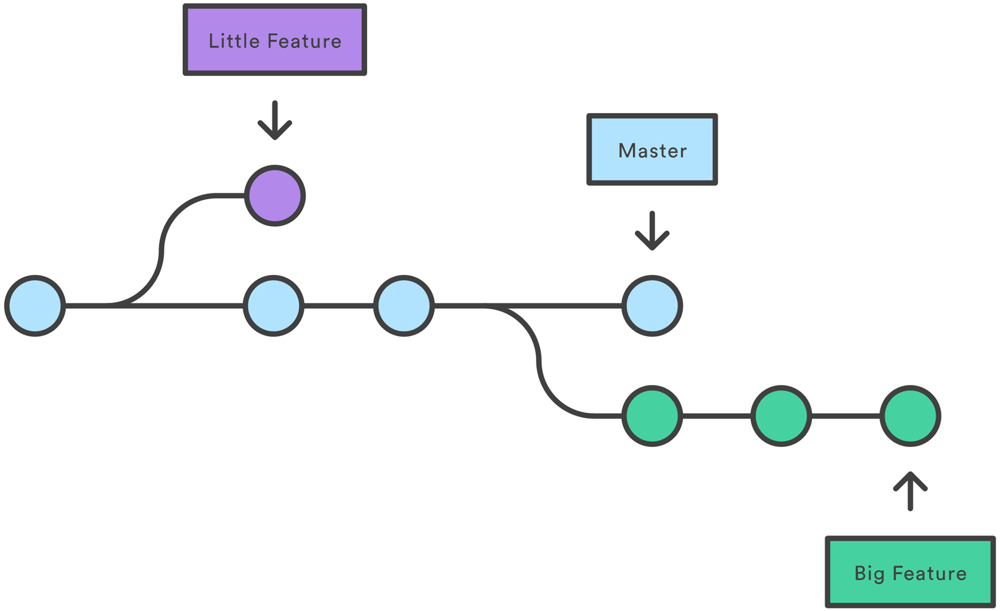
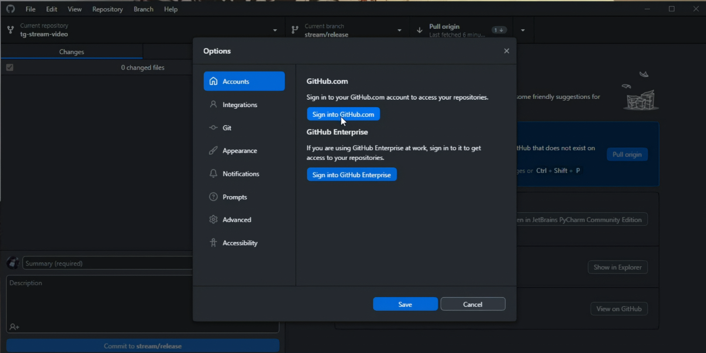
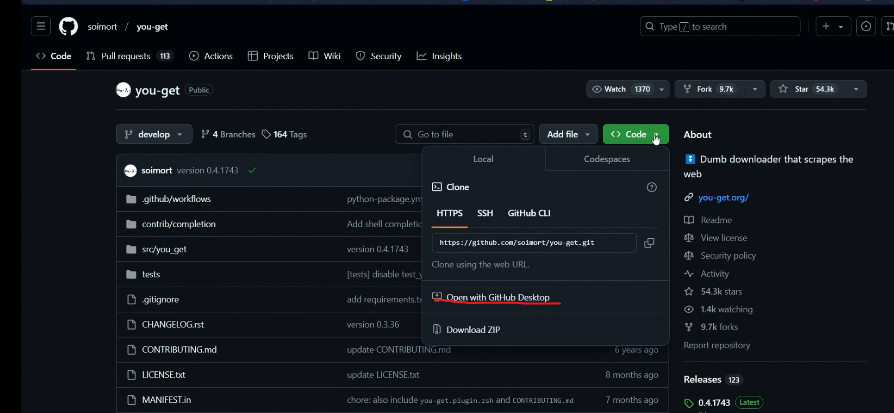
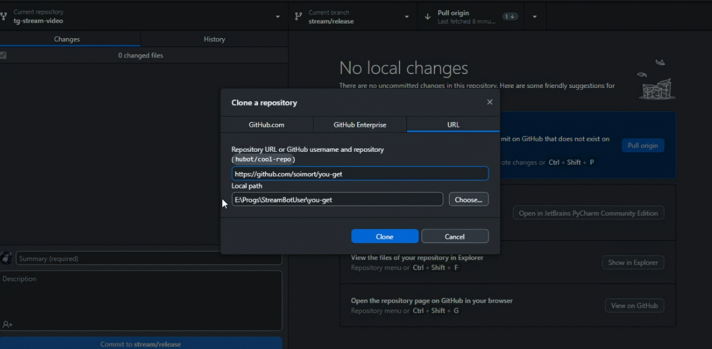
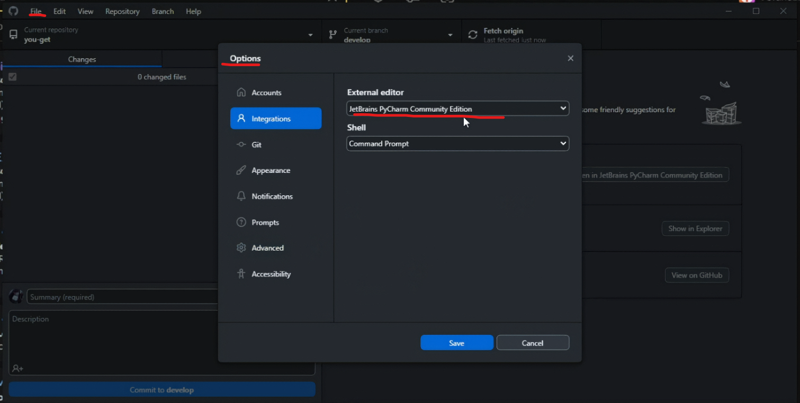

# Git Введение в команды: изучаем систему контроля версий Git. Урок 1

**Цель урока**: Познакомиться с системой контроля версий Git, веб-сервисом GitHub, установить GitGub Desktop и клонировать удаленный репозиторий.

## 1. Основная теория

Начинаем изучение с того, что узнаем, что такое система контроля версий git.

>[!TIP]
>Git — это система контроля версий, которая позволяет нескольким разработчикам одновременно работать над одним продуктом.
>
>Это специальная программа, которая позволяет отслеживать любые изменения в файлах, хранить их версии и оперативно возвращаться в любое сохранённое состояние.

Рассказываем, как могут хранится файлы в репозитории.

>[!TIP]
>Репозиторий (от англ. repository — хранилище) — место, где хранятся и поддерживаются какие-либо данные.

Файлы можно хранить как локально на компьютере, так и удаленно на серверах онлайн-сервисов. Примеры таких сервисов: GitHub, GitLab и другие.

>[!TIP]
>Локальный репозиторий Git — это хранилище, в котором находятся файлы проекта, их предыдущие версии и история всех изменений. Он располагается непосредственно на локальном компьютере.

Когда вы работаете с GitHub, вы взаимодействуете со своим локальным репозиторием (на вашем компьютере) и с удалённым репозиторием (на серверах GitHub). Вам нужно будет отправлять (push) свои локальные изменения в удалённый репозиторий и получать (pull) изменения от других разработчиков из удалённого репозитория в свой локальный.

>[!TIP]
>Git-репозиторий на серверах github это *удалённый репозиторий*. Удалённый репозиторий - это централизованное хранилище вашего проекта, размещённое на сервере GitHub. Он служит нескольким важным целям:
>
>* **Резервная копия**: Ваши данные в безопасности, даже если что-то случится с вашим локальным компьютером.
>* **Совместная работа**: Позволяет нескольким разработчикам работать над одним и тем же проектом одновременно, обмениваясь изменениями.
>* **Общий доступ**: Другие люди могут просматривать и загружать ваш проект.

## 2. Переходим к работе с *you-get*

Возьмем в качестве подопыдного репозиторий you-get.

[you-get](https://github.com/soimort/you-get?ysclid=m9lytlfnv0311260396) - Утлита you-get позволяет скачивать медиафайлы (видео, аудио, изображения) из интернета.

Теперь нам нужно получить данный репозиторий локально на наше устройство. Для есть множество различных способов. В рамках нашего уроке будем использовать программу GitHub Desktop.

Скачиваем и устанавливаем [GitHub Destop](https://github.com/user-attachments/assets/b5040572-e3ab-49d9-a24b-fb0453ce6b06).

>[!TIP]
>GitHub Desktop - это **графическое приложение (GUI) от GitHub, которое упрощает взаимодействие с Git и GitHub** без использования командной строки. Он предоставляет визуальный интерфейс для выполнения основных операций Git, таких как клонирование репозиториев, создание веток, фиксация изменений, отправка изменений (push), получение изменений (pull) и разрешение конфликтов.

Создаем аккаунт на сайте [GitHub](https://github.com/).

Заходим в аккаунт на GitHub Desktop. Можно использовать аккаунт GitHub (в который вы уже зашли).

Продолжаем работу с [you-get](https://github.com/soimort/you-get?ysclid=m9lytlfnv0311260396). Теперь с сайте GitHub попробуем получить к себе на устройство данный репозиторий. 

Делаем клон данного репозитория, также можно нажать на кнопку "Choose...", чтобы выбрать место, где мы хотим хранить клон репозитория.

>[!TIP]
>`git clone` - это команда Git, которая **копирует удалённый репозиторий Git на ваш локальный компьютер**. Она создаёт полную, работающую копию репозитория, включая все файлы проекта, историю изменений (коммиты) и ветки.

Теперь попробуем открыть клонированный репозиторий с помощью IDE. В данном случае буду использовать PyCharm. 

При нажатии правой кнопкой мыши на "Current repository" у вас отборажается через какаую IDE вы можете открыть данный проект.

Если вы не наблюдаете вашей IDE, то заходим File/Settings/Integrations и выбираем желаемый external editor (внешний редактор).

Открываем проект и подтверждаем создание вертуальной среды.
