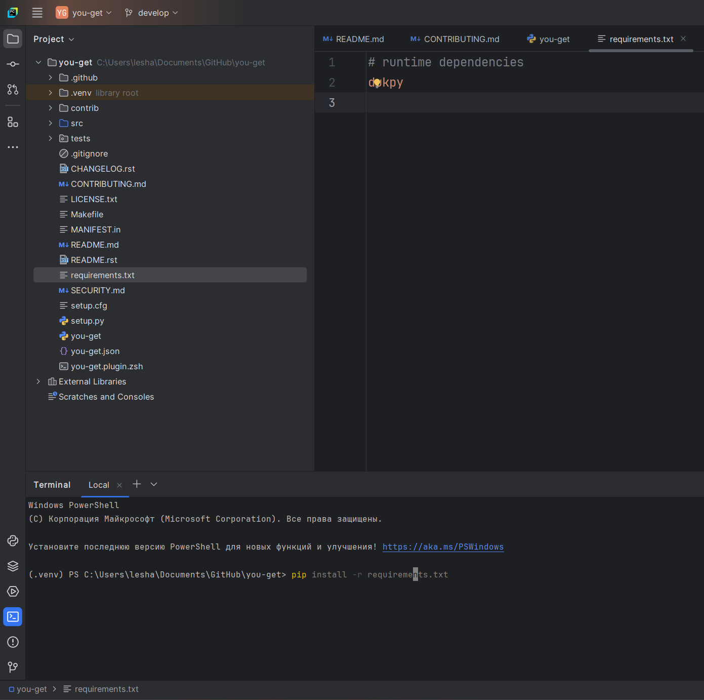
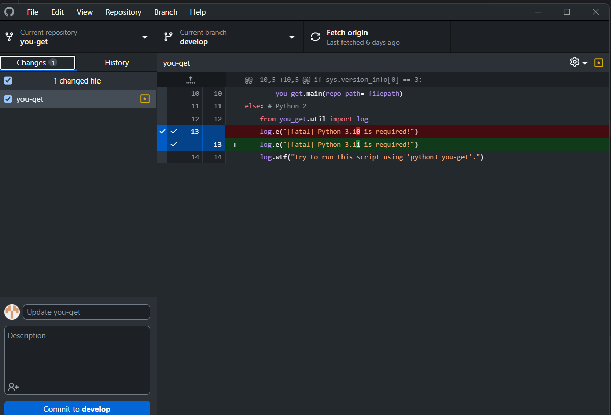
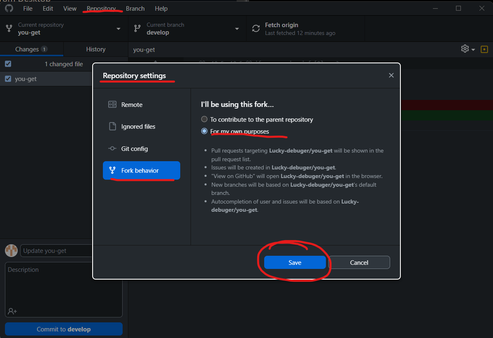
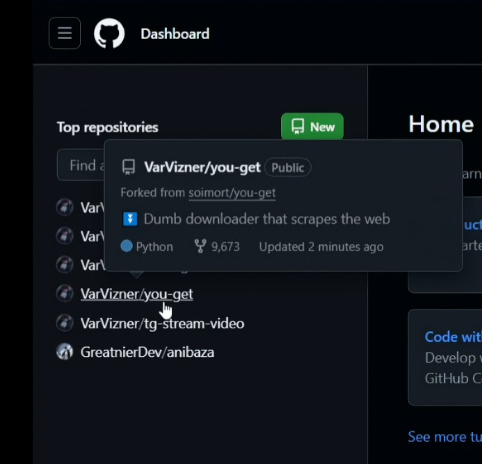
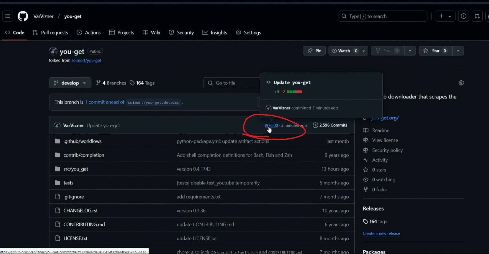
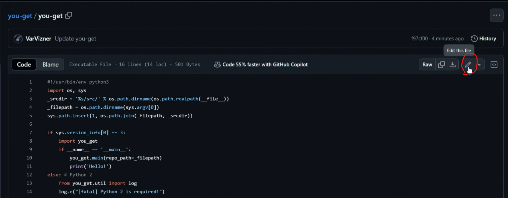
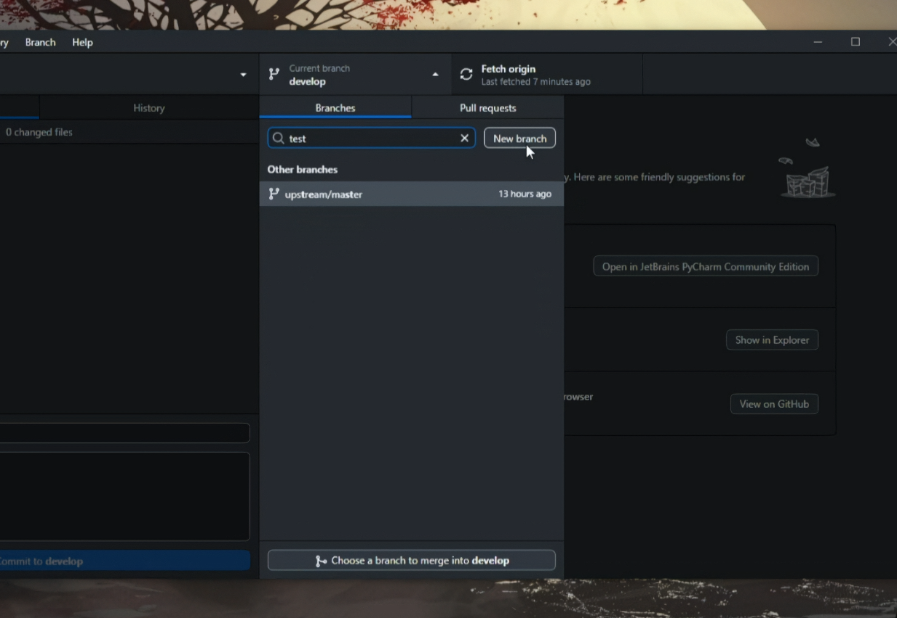
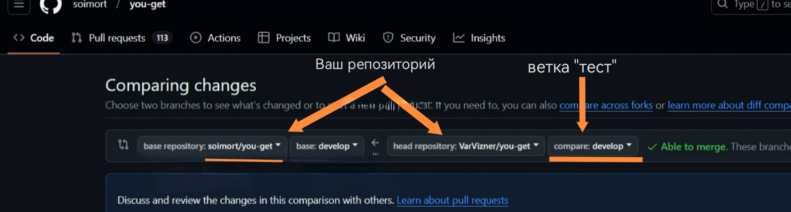

# Введение в команды: создаем репозиторий. Урок 2

**Цель урока**:

## 1. Разбираемся с командами `Push` и `Pull`

Для установки всех пакетов, перечисленных в файле requirements.txt, используйте команду: `pip install -r requirements.txt`. Эта команда автоматически установит все необходимые библиотеки, чтобы ваш проект работал корректно.

Делаем изменения в файле you-get, сохраняем и заходим в GitHub Desktop, чтобы увидеть изменения. Можно изменить буквально, что угодно.

Создаем fork (находится рядом с commit) и сохраняем изменения на нашем репозитории, после делаем commit. Если кнопки создать fork у вас нет по какой-либо причине, то можно зайти в настройки и указать, что вы хотитие сделать fork для себя.

>[!TIP]
>**Форк в Git** — это личная копия чужого репозитория, которая хранится в учётной записи на GitHub.
>
>Форк репозитория позволяет свободно экспериментировать с изменениями, не затрагивая исходный проект. Это особенно полезно для участия в проектах с открытым исходным кодом.
>
>**Некоторые особенности форка**:
>
>* **Независимая копия**. Изменения, внесённые в форк, не влияют на оригинал.
>
>* **Вклад**. Можно изменить свой форк, а затем создать запрос на извлечение, чтобы предложить изменения в исходном репозитории.
>
>* **Совместная работа**. Форки полезны для совместной разработки, когда несколько участников могут работать над своими версиями и вносить изменения в исходный проект с помощью запросов на извлечение.

Показываем вкладку история, используем свреху команду push origin.

>[!TIP]
>push origin — это команда, которая позволяет отправлять локальную ветку на удалённый репозиторий.
>
>**git push**: Это команда Git, которая отправляет (загружает) локальные коммиты в удаленный репозиторий. По сути, вы говорите: “Git, возьми мои локальные изменения и отправь их на сервер”.
>
>**origin**: Это псевдоним (alias) для URL-адреса вашего удаленного репозитория. По умолчанию, когда вы клонируете репозиторий с GitHub, origin автоматически настраивается как URL-адрес этого репозитория на GitHub. Думайте об origin как о сокращенном имени для удаленного репозитория.

Заходим на GitHub и ищем наш репозитоий.

Проверям где мы сделали коммиты.

Изменяем любой файлик в репозитории (делаем на сайте GitHub), чтобы потом стянуть себе изменения. Например, можно изменить файлик you-get. Потом делаем commit.

Заходим в GitHub Desktop и жмем `fetch origin`, чтобы получить изменения сделанные на удаленным репозитории.

>[!TIP]
>**git fetch origin** — это команда в распределённой системе контроля версий Git, которая **используется для обновления локального репозитория с изменениями из удалённого репозитория**.
>
>Она загружает коммиты, файлы и ссылки из удалённого репозитория без слияния их с текущей веткой.

А потом используем `pull origin`.

>[!TIP]
>Pull origin — это команда, которая загружает изменения из удалённого репозитория (origin) в локальный репозиторий (main).
>
>Она не только загружает последние изменения, но и автоматически сливает их с текущей локальной веткой

Потом заходим в pycharm и проверяем изменения.

Также можно заметить, что все коммиты, которые были сделаны когда-либо находятся во вкладке история.

## Разбираемся с ветками

Теперь можно разобраться подробнее с коммитами и ветками.

В Git, **коммит** – это как моментальный снимок вашего проекта в определенный момент времени. Он фиксирует все изменения, которые вы внесли в файлы с момента последнего коммита. Каждый коммит имеет уникальный идентификатор, автора, дату и комментарий, описывающий изменения. Представьте, что это запись в истории вашего проекта.

**Ветки** – это как параллельные вселенные вашего проекта. Каждая ветка представляет собой отдельную линию разработки. Обычно, есть основная ветка (часто называется `main` или `master`), которая содержит стабильную версию проекта.

Зачем нужны ветки?

* **Изоляция изменений**: Вы можете создавать новые ветки для разработки новых функций, исправления ошибок или проведения экспериментов, не затрагивая основную ветку.
* **Параллельная разработка**: Несколько разработчиков могут одновременно работать над разными задачами в разных ветках.
* **Сохранение стабильности**: Основная ветка остается стабильной, пока изменения из других веток не будут тщательно протестированы и одобрены.

Как это работает вместе:

* Вы создаете новую ветку от основной ветки.
* Вы вносите изменения в файлы в этой новой ветке.
* Вы создаете коммиты, фиксируя свои изменения в этой ветке.
* После того, как изменения протестированы и готовы, вы объединяете (merge) свою ветку обратно в основную ветку.

Создаем новую ветку в GitHub Desktop и даем ей имя, например, "test".

Нажимаем Publish branch.

>[!TIP]
>**Publish branch** — это создание новой ветки в удалённом репозитории и отправка в неё локальных изменений, что позволяет другим пользователям получить доступ к работе. 

Смотрим на GitGub, что данная ветка появилась.

Попробуем изменить данную ветку в нашей IDE (удаляем любые файлы проекта, кроме venv и github), делаем commit и пушим (кнопка сверху).

Заходим на GitHub и наблюдаем за нашей веткой (test).

Теперь попробуем внести изменения в ветку develop для это в PyCharm создадим новый файлик с кодом.

Коммитим, пушим, заходим в GitHub и смотрим за изменениями в нашей ветке test.

Пробуем объединить ветки test и develop. На сайте GitHub заходим в pull requests и выбираем какие ветки будем сливать (ваше имя git) и кого (ветка test).

Создаем pull request.

>[!TIP]
>**Pull Request** (PR) — это запрос на внесение изменений в код, используемый в системах контроля версий, таких как GitHub, GitLab и Bitbucket. 
>
>С помощью Pull Request разработчик может предложить свои изменения для основной ветки проекта или другой ветки, дать команде возможность просмотреть изменения, обсудить их и принять или отклонить их интеграцию. 
>
>Процесс работы Pull Request:
>
>* **Создание новой ветки**. Разработчик обычно создаёт отдельную ветку для новых изменений, чтобы они не влияли на основной код до завершения работы.
>* **Внесение изменений**. В новой ветке разработчик работает над функцией или исправлением, делает коммиты и сохраняет версии.
>* **Открытие Pull Request**. Когда изменения завершены, разработчик отправляет PR, чтобы запросить слияние своей ветки с основной (например, main или master) или другой целевой веткой. В PR показываются все изменения, добавленные разработчиком. 1
>* **Код-ревью**. Остальные участники команды могут просмотреть PR, оставить комментарии и предложить доработки. Это важная часть процесса, так как позволяет обнаружить потенциальные ошибки и улучшить качество кода.
>* **Слияние**. После одобрения изменений они могут быть слиты с основной веткой, обычно с помощью одного клика. Изменения становятся частью основной ветки, и проект обновляется с учётом новых функций или исправлений.

Делаем merge.

>[!TIP]
>Git merge — команда в системе контроля версий Git, которая позволяет объединять изменения из одной ветки в другую.
>
>Некоторые особенности команды:
>
> **Сохраняет историю изменений**. Это полезно для отслеживания изменений и анализа истории проекта.
>
> **Создаёт коммит слияния**. Он связывает истории обеих веток, делая очевидным факт их объединения.
>
> **Простота использования**. Команда не вызывает затруднений у начинающих и оптимальна в ситуациях, когда важно сохранить историю.

После видим, что всё с ветки develop удалилось файлы. Причина тому, когда мы делали ветку test, то наши изменения, а именно удаления тоже запомнились и поэтому они применились к ветке develop. Также не забудьте после совершения слияния посмотреть на различные вкладки, которые есть в разделе pull request.

На след уроке посмотрим, как откатывать изменния
