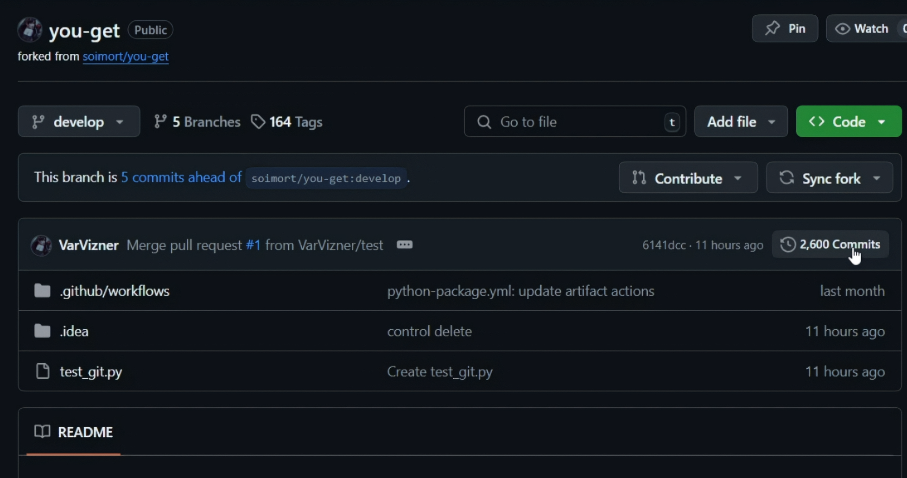

# Введение в команды: изучаем Git Bash. Урок 3

**Цель урока**: Научиться устанавливать Git Bash, освоить основные команды Git для работы с репозиторием и разрешать конфликты, возникающие при слиянии веток.

## 1. Установка Git на ПК

Заходим на сайт [Git](https://git-scm.com/downloads???windows), что скачать и установить его себе. Не забываем поставить галочки на Git Bash Here и Git GUI Here. В последнем окне оставляем Use Git Bash only.

Заранее открываем папку с проектом you-get в вашей IDE.

Заходим на GitHub в наш fork проекта you-get, чтобы посмотреть более подробную историю коммитов.

Теперь на ПК нам нужно открыть попку нашего проект you-get с помощью Git Bash.

## 2. Знакомимся с командами в Git Bash

Можно рассказать ученикам, что все команды, которые мы делали через GitHub Desktop, также можно сделать через Git Bash

## Примеры использования Git Bash (командная строка)

Вот несколько простых примеров использования Git Bash и основных команд Git:

| Команда Git Bash | Описание                                                                                   | Пример                                                                 | Пояснение                                                                                                                                 |
| ----------------- | ------------------------------------------------------------------------------------------ | --------------------------------------------------------------------- | ----------------------------------------------------------------------------------------------------------------------------------------- |
| `pwd`             | Отображает текущий рабочий каталог.                                                          | `pwd`                                                                 | Выводит путь к текущей папке, в которой вы находитесь в Git Bash.                                                                       |
| `ls`              | Выводит список файлов и подкаталогов в текущем каталоге.                                     | `ls` или `ls -l` (подробный вывод)                                     | Показывает файлы и папки в текущей директории. `-l` добавляет больше информации (размер, дата изменения, права доступа).            |
| `cd`              | Изменяет текущий рабочий каталог.                                                          | `cd Documents` или `cd ..` (переход на уровень выше)                   | Перемещает вас в другую папку. `cd ..` позволяет вернуться на один уровень вверх.                                                       |
| `mkdir`           | Создает новый каталог (папку).                                                            | `mkdir my_new_folder`                                                 | Создает папку с именем "my_new_folder" в текущей директории.                                                                          |
| `rmdir`           | Удаляет пустой каталог.                                                                   | `rmdir my_empty_folder`                                               | Удаляет пустую папку "my_empty_folder" из текущей директории.                                                                           |
| `touch`           | Создает новый пустой файл.                                                                 | `touch my_new_file.txt`                                               | Создает пустой текстовый файл "my_new_file.txt" в текущей директории.                                                                 |
| `rm`              | Удаляет файлы.                                                                              | `rm my_file.txt`                                                      | Удаляет файл "my_file.txt" из текущей директории. **Внимание:** Файлы удаляются безвозвратно!                                      |
| `git init`        | Инициализирует новый Git-репозиторий в текущем каталоге.                                      | `git init`                                                            | Превращает текущую папку в Git-репозиторий, где можно отслеживать изменения файлов.                                                     |
| `git status`      | Отображает состояние рабочего каталога и подготовленных к коммиту изменений.                   | `git status`                                                          | Показывает, какие файлы изменены, подготовлены к коммиту или не отслеживаются Git.                                                      |
| `git add`         | Добавляет изменения из рабочего каталога в область подготовленных файлов (staging area).      | `git add .` (добавить все изменения) или `git add my_file.txt` (добавить конкретный файл) | Помечает файлы, которые вы хотите включить в следующий коммит. `.` означает "все файлы".                                                        |
| `git commit`      | Фиксирует изменения из области подготовленных файлов в локальный репозиторий.                      | `git commit -m "Описание изменений"`                               | Создает снимок текущего состояния репозитория с кратким описанием изменений. Описание (сообщение коммита) важно для понимания истории. |
| `git log`         | Отображает историю коммитов в текущем репозитории.                                       | `git log` или `git log --oneline` (более компактный вывод)            | Показывает список всех коммитов, сделанных в репозитории, с информацией об авторе, дате и сообщении.                                  |
| `git branch`      | Управляет ветками (создание, просмотр, удаление).                                         | `git branch` (показать список веток), `git branch new_branch` (создать ветку) | Позволяет работать над разными частями проекта параллельно. `git branch` без аргументов показывает список всех веток в репозитории. |
| `git checkout`    | Переключается между ветками.                                                               | `git checkout new_branch`                                               | Переключает вас на другую ветку, позволяя вносить изменения изолированно.                                                             |
| `git pull`        | Получает изменения из удаленного репозитория и объединяет их с текущей веткой.              | `git pull origin main` (получить изменения из ветки `main` репозитория `origin`) | Обновляет ваш локальный репозиторий, скачивая последние изменения из удаленного репозитория.                                              |
| `git push`        | Отправляет изменения из локального репозитория в удаленный репозиторий.                     | `git push origin main` (отправить изменения в ветку `main` репозитория `origin`) | Загружает ваши локальные коммиты на удаленный репозиторий, делая их доступными другим разработчикам.                                        |

**Важные замечания:**

*   Эта таблица содержит только базовые команды. Git имеет гораздо больше возможностей.
*   Замените `my_file.txt`, `my_new_folder`, `new_branch`, `origin main` на ваши собственные имена файлов, папок, веток и удаленных репозиториев.
*   Перед выполнением команд убедитесь, что вы находитесь в правильном каталоге (внутри вашего Git-репозитория).
*   Для получения справки по любой команде Git используйте `git help <команда>` (например, `git help commit`).
*   `origin` - это псевдоним для URL-адреса вашего удаленного репозитория.  Он обычно автоматически настраивается при клонировании репозитория.
*   Будьте осторожны с командой `rm`, так как она удаляет файлы безвозвратно.  Проверьте, что вы удаляете правильные файлы.

## 3. Переходим к работе с Git Bash

Не забывайте, что пояснения к командами есть выше.

Показываем, как можно менять ветки в Git.

Пишем `git branch`.

Переходим на другую ветку `git checkout develop`.

Возращаемся на изначальную ветку `git checkout test`.

Возращаемся в историю коммитов на GitHub, найдем коммит, где мы еще ничего не удалили и копируем его.

В GitBash пришем `git reveret копия вешего коммита`.

>[!TIP]
>Команда `git revert` используется для отмены определённого коммита и создания нового коммита, который отменяет изменения предыдущего коммита. 
>
>В результате история в Git не теряется, что важно для обеспечения целостной истории версий и надёжной совместной работы. 
>
>Синтаксис команды: git revert <commit>, где <commit> — это хэш-идентификатор коммита, который нужно отменить.

И мы видим ошибку т.к. возникли различные конфликты с файлами. И Git нам предлогает решить эту проблему разными способами.

Пробуем для начала команду `git config advice.mergeConflict false`. 

>[!TIP]
>Команда «git config advice.mergeConflict false» отключает сообщение о конфликтах слияния в Git.

Проверяем, что мы получили в папке с проектом и видим, что не всё пошло по плану т.к. Git не до конца понимает, что мы от него хотим.

Теперь давайте отменим все изменения, чтобы можно было попробовать еще раз `git revert --abort`. Проверяем изменения

>[!TIP]
>`git revert --abort` отменяет процесс слияния или перемотки (rebase), который привел к конфликтам, и возвращает репозиторий в состояние, предшествующее началу этого процесса. Он полезен, когда вы столкнулись с трудностями при разрешении конфликтов, и хотите просто отказаться от этих изменений и начать заново или продолжить работу над чем-то другим.

Ещё раз в GitBash пришем `git reveret копия вешего коммита`. Теперь пробуем решить данный конфликт.

Пишем `git mergetool`. Смотрим, какие конкретно есть конфликты. А потом пишем `m`, чтобы модифицировать.

>[!TIP]
>`git mergetool` — команда в Git, которая запускает внешний инструмент слияния и помогает разработчикам эффективно разрешать конфликты, возникающие во время слияния

Смотрим за изменениями в проекте (заходим в IDE).

Теперь попробуем перейти на ветку develop `git checkout develop`. И видим, что GitBush просит нас подтвердить изменения, которые мы сделали.

Пишем `git commit`.

Далее поработаем над своим проектом.
