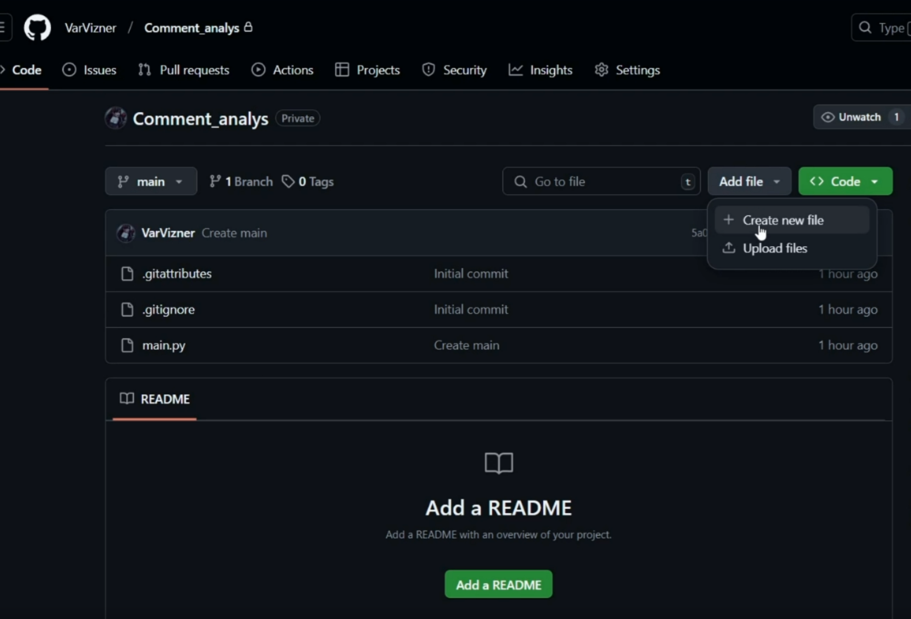
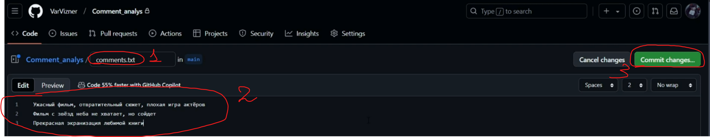
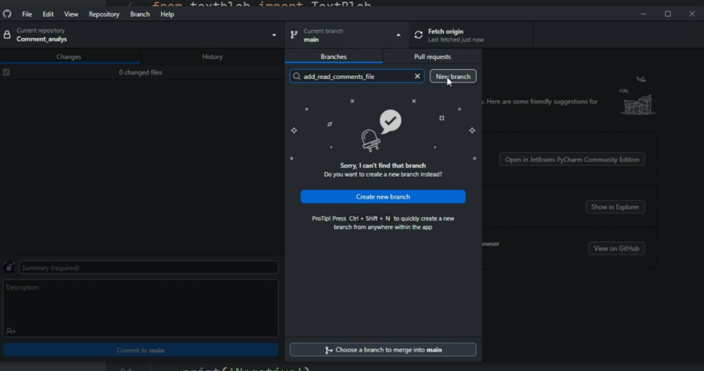

# Используем Git на практике. Анализ эмоциональной окраски текста. Часть 2. Урок 5

**Цель урока**: Продолжить работу над проектом анализатор эмоциональной окраски текста, используя Git.

## 1. Выбор другой модели для обработки текста

Заходим в GitHub Desktop и IDE

Теперь попробуем воспользоваться не моделью `ru_core_news_sm`, а другой моделью, чтобы улучшить обработку текста.

В терминале пишем команду:

```bash
python -m spacy download ru_core_news_md
```

>[!TIP]
>`python -m spacy download ru_core_news_md`: Устанавливает языковую модель ru_core_news_md для библиотеки spaCy на Python. Эта модель нужна для обработки русского текста, включая лемматизацию, определение частей речи и т.д.

Теперь поработаем над лемматизацией текста.

>[!TIP]
>Лемматизация текста — это процесс приведения слова к его словарной форме (лемме). Представьте, что у вас есть разные формы слова, например: “бежал”, “бежит”, “бегущие”. Лемматизация преобразует все эти формы к одной, базовой форме – “бежать”.
>
>Простыми словами: Лемматизация - это как если бы вы разбирали слово по частям и оставляли только его основу, чтобы понимать, что это за слово.

Дополняем код новой моделью. Новые строке отметил в конце `*`.

``` python
from spacy.lang.ru import Russian
from spacy.lang.ru.stop_words import STOP_WORDS
import ru_core_news_md #*

#model = Russian()
model = ru_core_news_md.load() #*

text = model("Фильм очень понравился, хороший сюжет, классные актеры, но концовка чуть испортила впечатление, а так твёрдая 8")

text_list = [i for i in text]
print(text_list)

filter_text_list = [i for i in text_list if not i in STOP_WORDS]

lemma_text = [i.lemma_ for i in text] #*
print(lemma_text) #*
```

## 2. Применение лемматизации и фильтрации одновременно

После того, как протестировали код установки модели, попробуем теперь одновременно применить и лемму, и фильтр.  Это позволит нам более точно анализировать текст, отсеивая нерелевантные слова и приводя оставшиеся к их словарной форме.

``` python
from spacy.lang.ru import Russian
from spacy.lang.ru.stop_words import STOP_WORDS
import ru_core_news_md

#model = Russian()
model = ru_core_news_md.load()

text = model("Фильм очень понравился, хороший сюжет, классные актеры, но концовка чуть испортила впечатление, а так твёрдая 8")

lemma_text = [i.lemma_ for i in text] #*

filter_text_list = [i for i in lemma_text if not i in STOP_WORDS] #*
print(filter_text_list)
```

Теперь проверяем, чтобы наши изменения отобразились в GitHub Desktop. Коммитим, пушим. Также можно проверить изменения на GitHub.

Теперь проверяем, чтобы наши изменения отобразились в GitHub Desktop. А потом:

*   **Коммитим:**  Создаем коммит с описанием изменений.
*   **Пушим:**  Отправляем коммит в удаленный репозиторий на GitHub.

Также можно проверить изменения непосредственно на GitHub, чтобы убедиться, что они успешно применены.

## 3. Нахождение положительных и отрицательных слов

Переходим к нахождению положительных и отрицательных слов.

Устанавливаем пакет textblob версии 0.18.0.post0.

Дополняем наш код новым функционалом.

``` python
from spacy.lang.ru import Russian
from spacy.lang.ru.stop_words import STOP_WORDS
from textblob import TextBlob #*
import ru_core_news_md

#model = Russian()
model = ru_core_news_md.load()

text = model("Фильм очень понравился, хороший сюжет, классные актеры, но концовка чуть испортила впечатление, а так твёрдая 8")

lemma_text = [i.lemma_ for i in text]
filter_text_list = [i for i in lemma_text if not i in STOP_WORDS]

analysis = TextBlob(str(filter_text_list)) #*
sentiment = analysis.sentiment.polarity #*

if sentiment > 0: #*
	print("Positive") #*
elif sentiment < 0: #*
	print("Negative") #*
else: #*
	print("Neutral") #*
```

Тестим код выше, а именно в `text = model("...")` пишем разные вариации комментариев, чтобы проверить правильно ли наша программа анализирует отзыв.

В итоге, мы видим, что нет. Т.к. на данный момент пакет `textblob` умеет работать только с английским языком.

## 4. Добавляем работу с пакетом translate

Устанавливаем пакет `translate` версии 3.6.1 и дополняем наш код новым функционалом.

``` python
from spacy.lang.ru import Russian
from spacy.lang.ru.stop_words import STOP_WORDS
from textblob import TextBlob
from translate import Translator #*
import ru_core_news_md

#model = Russian()
model = ru_core_news_md.load()

text = model("Фильм очень понравился, хороший сюжет, классные актеры, но концовка чуть испортила впечатление, а так твёрдая 8")

lemma_text = [i.lemma_ for i in text]
filter_text_list = [i for i in lemma_text if not i in STOP_WORDS]

translator = Translator(from_lang="Russian", to_lang="English") #*
translated_text = translator.translate(str(filter_text_list)) #*

analysis = TextBlob(translated_text) #*
sentiment = analysis.sentiment.polarity

if sentiment > 0:
	print("Positive")
elif sentiment < 0:
	print("Negative")
else:
	print("Neutral")
```

Тестим код выше, а именно в `text = model("...")` пишем разные вариации комментариев, чтобы проверить правильно ли наша программа анализирует отзыв.

Делаем новый коммит пишем в нём, что у нас "finish version 1.0", пушим.


## 5. Добавляем изменения другого участника (представляем, что он есть) с GitHub

Заходим в GitHub в наш репозиторий и добавляем новый файл.



Делаем его текстовым, пишем туда комментарии и жмем "commit changes...".



Возвращаемся на GitHub Desktop делаем "Fetch origin" и "Pull origin". Не забываем с ребятами проговаривать, что делает каждая из команд.

Проверяем в IDE, что новый файл появился.

## 6. Самостоятельная работа

Даем ученика самостоятельную задачу, чтобы они сами попробовали воспользоваться данными из файла (прочитать их и проанализировать с помощью нашей программы), но перед этим создаем новую ветку.



## 7. Итоговый код с комментариями

```python
from spacy.lang.ru import Russian  # Импорт класса Russian из библиотеки spacy для русского языка (устарело, лучше использовать ru_core_news_md)
from spacy.lang.ru.stop_words import STOP_WORDS  # Импорт списка стоп-слов для русского языка из spacy
from textblob import TextBlob  # Импорт класса TextBlob из библиотеки textblob для анализа тональности
from translate import Translator  # Импорт класса Translator из библиотеки translate для перевода текста
import ru_core_news_md # Импорт предобученной модели для русского языка

#model = Russian() # Загрузка языковой модели (устарело)
model = ru_core_news_md.load() # Загрузка предобученной модели spacy для русского языка (лучший вариант)

text = model("Фильм очень понравился, хороший сюжет, классные актеры, но концовка чуть испортила впечатление, а так твёрдая 8")  # Создание объекта Doc из входного текста с использованием модели spacy

lemma_text = [i.lemma_ for i in text]  # Лемматизация текста: извлечение лемм для каждого токена (слова) в тексте
filter_text_list = [i for i in lemma_text if not i in STOP_WORDS]  # Удаление стоп-слов из лемматизированного текста: создание списка слов, которые не являются стоп-словами

translator = Translator(from_lang="Russian", to_lang="English")  # Создание объекта Translator для перевода с русского на английский
translated_text = translator.translate(str(filter_text_list))  # Перевод очищенного текста на английский

analysis = TextBlob(translated_text)  # Создание объекта TextBlob из переведенного текста для анализа тональности
sentiment = analysis.sentiment.polarity  # Получение значения полярности тональности (от -1 до 1)

if sentiment > 0:  # Определение тональности на основе значения полярности
	print("Positive")  # Если полярность положительная, тональность положительная
elif sentiment < 0:  # Если полярность отрицательная, тональность отрицательная
	print("Negative")
else:  # Если полярность равна 0, тональность нейтральная
	print("Neutral")
```
