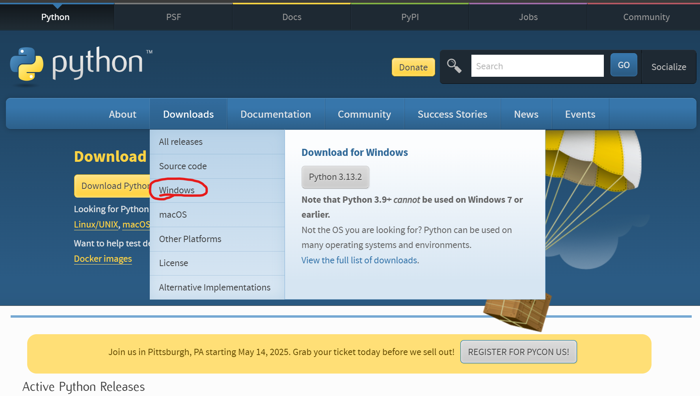
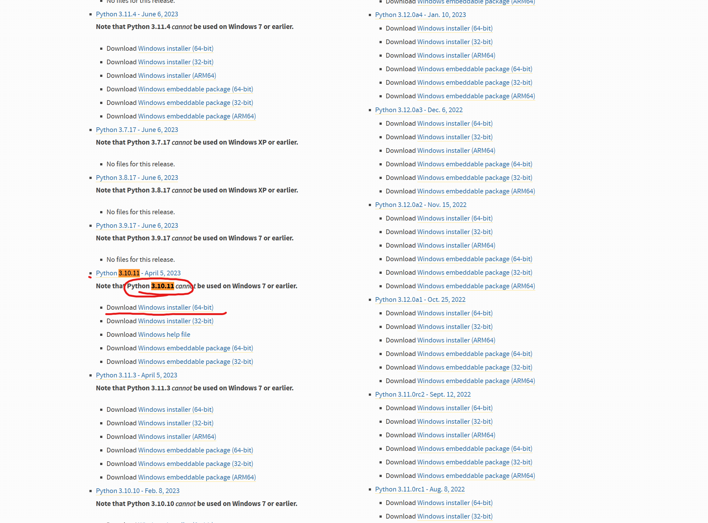
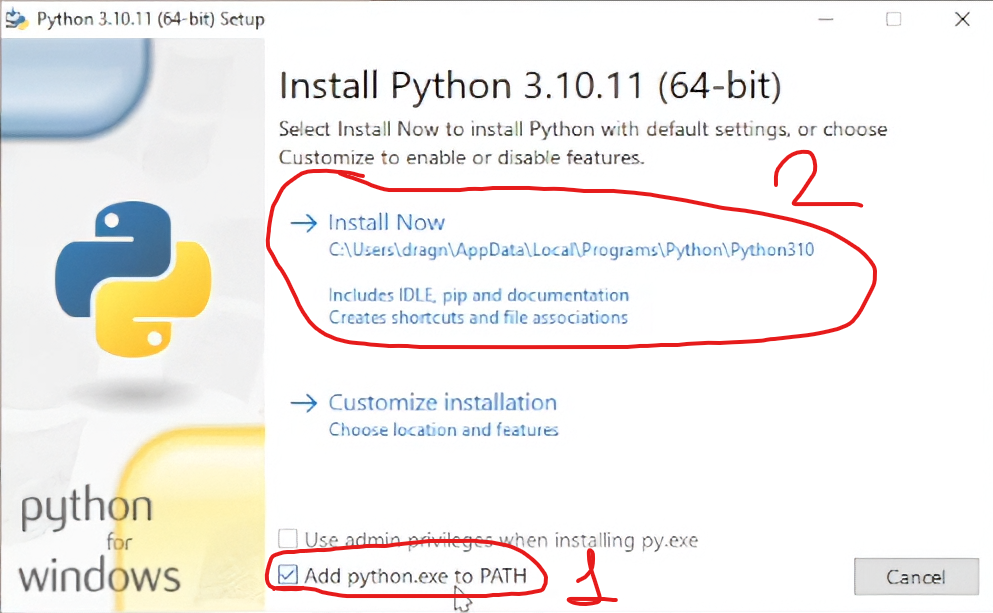
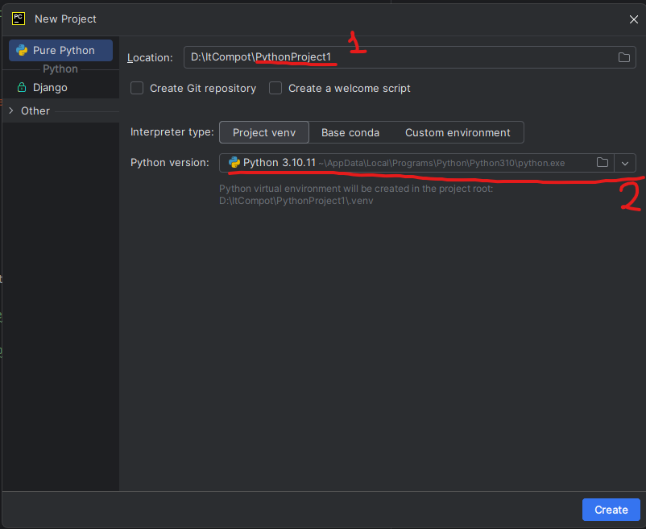
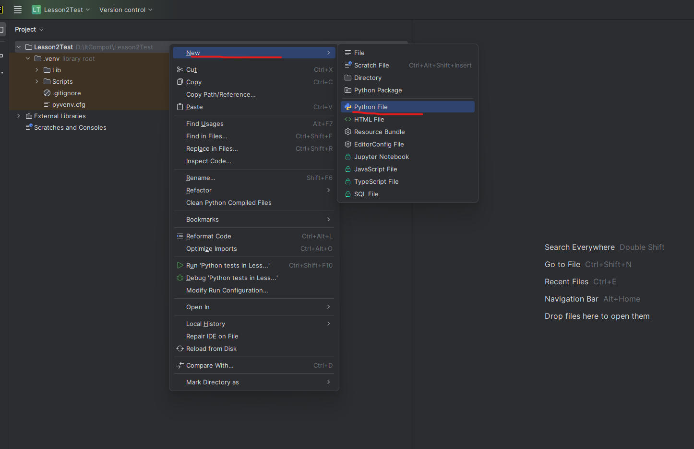
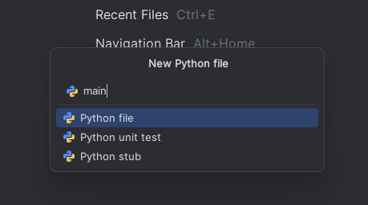
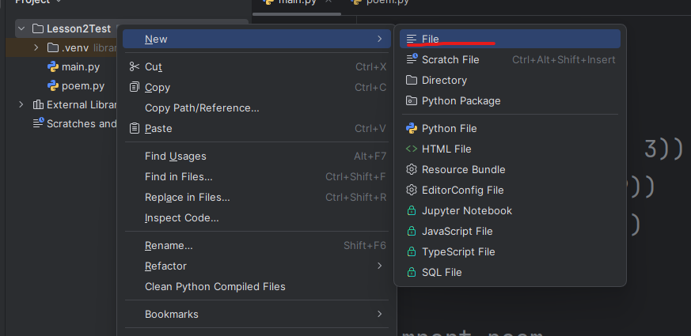
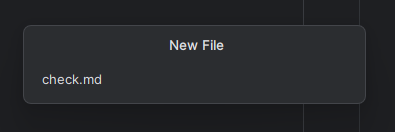
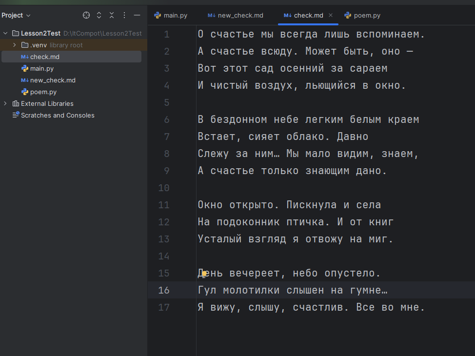
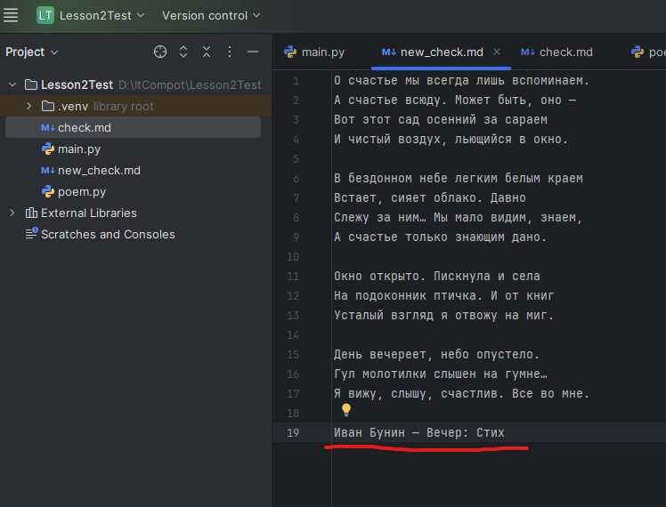

# Python: Основы. Урок 2

**Цель урок** Познакомиться с ключевыми элементами языка Python: импорт библиотек, запись и чтение файлов.

## 1. Установка Python 3.12 на ПК

В этом курсе мы будем использовать Python 3.12. Почему не самую новую версию?

* **Стабильность:** Python 3.12 проверен и стабилен, что важно для обучения.

* **Совместимость:** Эта версия гарантированно работает со всеми нужными нам библиотеками.

* **Поддержка:** У Python 3.12 большое сообщество, и легко найти ответы на вопросы.

* **Обучение основам:** Главные концепции работают одинаково и в новых версиях.

Выбор Python 3.12 упростит обучение и позволит сосредоточиться на основах программирования. Более новые версии можно освоить позже.

Скачивать будем с офицального сайта [python.org](https://www.python.org/downloads/).

Шаг 1


Шаг 2


После скачивание приступаем к установке. Главное не забыть поставить галочку на `PATH` при установке.



>[!TIP]
>**PATH** — это переменная среды в вашей операционной системе (Windows, macOS, Linux), которая содержит список каталогов (папок). Когда вы вводите команду в командной строке (терминале) или в консоли, операционная система ищет эту команду в каталогах, перечисленных в переменной PATH.
>
>Добавление Python в PATH позволяет запускать `python` и `pip` из любой папки в командной строке. Без этого пришлось бы каждый раз указывать полный путь к Python, что неудобно. Это упрощает разработку и позволяет другим программам находить Python.

Скачиваем и устанавливаем Pycharm Community Edition [www.jetbrains.com](https://www.jetbrains.com/pycharm/download/?section=windows)

## 2. Подготвка IDE Pycharm Community Edition к работе

>[!TIP]
>IDE (Integrated Development Environment) — это программа, которая объединяет все необходимые инструменты для разработки программ: редактор кода, компилятор/интерпретатор, отладчик и т.д., для более удобной работы программиста.

Выбираем новый проект. Название проекта задаем там, где написана цифра 1. Также проверем необходимую версию Python (3.10 - 3.12).



После нажимаем правой кнопкой мыше на имя нажего преокта в моем случае Lesson2Test и создаем новый `Python File` c именем "main".





## 3. Импорт библиотек

Разбираем с учениками несколько простых примеров.

Пример 1:

```python
import random  # Импортирует модуль 'random' для генерации случайных чисел.
print(random.randint(1, 15))  # Выводит случайное целое число в диапазоне от 1 до 15 (включительно).
```

Пример 2:

```python
import math  # Импортирует модуль 'math' для математических функций.
print(math.pi)  # Выводит значение числа Пи (π).
print(math.pow(2, 3))  # Выводит 2 в степени 3 (т.е., 2³ = 8.0).
print(math.sqrt(9))  # Выводит квадратный корень из 9 (т.е., √9 = 3.0).
print(math.cos(5))  # Выводит косинус угла 5 радиан.
```

Разбирем еще один пример, где создаем новый python файл и записываем туда поэму, чтобы потом импортировать его.

Создаем python файл `poem.py`. И прописываем там поэму в переменной text c тройными ковычкамиж.

>[!TIP]
>Тройные кавычки в Python (`'''` или `"""`) используются для создания:
>
>* **Многострочных строк**: Строки, которые занимают несколько строк в коде.
>* **Строк документации (docstrings)**: Для написания документации к функциям, классам и модулям.
>* **Комментариев (иногда)**: Хотя `#` предпочтительнее, их можно использовать для многострочных комментариев.

```python
text = '''
    О счастье мы всегда лишь вспоминаем.
    А счастье всюду. Может быть, оно —
    Вот этот сад осенний за сараем
    И чистый воздух, льющийся в окно.
    
    В бездонном небе легким белым краем
    Встает, сияет облако. Давно
    Слежу за ним… Мы мало видим, знаем,
    А счастье только знающим дано.
    
    Окно открыто. Пискнула и села
    На подоконник птичка. И от книг
    Усталый взгляд я отвожу на миг.
    
    День вечереет, небо опустело.
    Гул молотилки слышен на гумне…
    Я вижу, слышу, счастлив. Все во мне.
'''
```

Теперь пробуем получить строку(стих) из переменной `text` файла `poem.py` в основном файлике с кодом `main.py`.

```python
import poem  # Импортирует модуль (файл) с именем 'poem'.
print(poem.text)  # Выводит значение переменной 'text' (строки), находящейся в модуле 'poem'.
```

Разбераем следующий код, который проверяет есть ли определенное слово в стихе.

```python
import poem  # Импортирует модуль с именем 'poem' (одержащий текст).

def searching(text):
    # Функция для поиска подстроки в строке.
    search_word = input("Input word would you want to find: ")  # Запрашивает у пользователя слово для поиска.
    if text.find(search_word) != -1:
        # Проверяет, найдено ли слово в тексте. text.find() возвращает -1, если слово не найдено.
        print("We are found similar word!")  # Выводит сообщение, если слово найдено.
    else:
        print("We don't found similar word!")  # Выводит сообщение, если слово не найдено.

searching(poem.text)  # Вызывает функцию 'searching', передавая ей текст из модуля 'poem'.
```

## 4. Запись и чтение файлов

**Чтение**: Получение данных из файла. **Запись**: Сохранение данных в файл.

Создаем файл `check.md` и копируем туда наш стих с файла `poem.py` без переменной.





>[!TIP]
>`.md` файл (Markdown file) — это текстовый файл, использующий простой синтаксис Markdown для форматирования текста (заголовки, списки, ссылки и т.д.). Он легко читается и конвертируется в HTML или другие форматы.

Получилось так:



Считываем данный из файла `check.md` в нашем основном скрипте `main.py`.

```python

```

Теперь пробуем записать данные в новый файлик (файлик создастся сам, если его до этого не было).

```python

```

В итоге, в файлике `new_check.md` были записаны новые строки.



## 5. Задачи для закрепления теории функций и условных операторов:

**Уровень 1**: Простые задачи (разминка)

**Задача 1**: Четное или нечетное?

*Условие*: Напишите функцию `check_even_odd(number)`, которая принимает на вход целое число `number`. Функция должна возвращать строку “Четное”, если число четное, и “Нечетное”, если число нечетное.

```python
def check_even_odd(number):
  """Проверяет, является ли число четным или нечетным."""
  if number % 2 == 0:
    return "Четное"
  else:
    return "Нечетное"

print(check_even_odd(10))
print(check_even_odd(7))
```

**Задача 2**: Больше или меньше?

*Условие*: Напишите функцию `compare_numbers(a, b)`, которая принимает два целых числа: `a` и `b`. Функция должна возвращать строку, указывающую, какое число больше (например, “Первое число больше второго”), какое меньше (например, “Второе число больше первого”) или что числа равны.

```python
def compare_numbers(a, b):
  """Сравнивает два числа и возвращает результат."""
  if a > b:
    return "Первое число больше второго"
  elif a < b:
    return "Второе число больше первого"
  else:
    return "Числа равны"

print(compare_numbers(5, 3))
print(compare_numbers(1, 8))
print(compare_numbers(4, 4))
```


**Уровень 2**: Задачи средней сложности

**Задача 3**: Оценка по баллам

*Условие*: Напишите функцию `get_grade(score)`, которая принимает на вход целое число score (количество набранных баллов). Функция должна возвращать строковую оценку в соответствии со следующими правилами:

* 90 баллов и выше - “Отлично”

* 75 - 89 баллов - “Хорошо”

* 60 - 74 балла - “Удовлетворительно”

* Меньше 60 баллов - “Неудовлетворительно”


```python
def get_grade(score):
  """Определяет оценку по набранным баллам."""
  if score >= 90:
    return "Отлично"
  elif score >= 75:
    return "Хорошо"
  elif score >= 60:
    return "Удовлетворительно"
  else:
    return "Неудовлетворительно"

print(get_grade(95))
print(get_grade(80))
print(get_grade(65))
print(get_grade(50))
```

**Задача 4**: Калькулятор

*Условие*: Напишите функцию `calculate(num1, num2, operation)`, которая выполняет арифметические операции над двумя числами. Функция принимает три аргумента:

* `num1`: первое число (целое или десятичное).

* `num2`: второе число (целое или десятичное).

* `operation`: строка, обозначающая операцию. Допустимые значения: “+”, “-“, “*”, “/”.

Функция должна вернуть результат выполнения операции. Если `operation` равно “/”, и `num2` равно 0, функция должна вернуть строку “Ошибка: деление на ноль”. Если `operation` не является допустимой операцией, функция должна вернуть строку “Ошибка: неверная операция”.

```python
def calculate(num1, num2, operation):
  """Выполняет арифметическую операцию над двумя числами."""
  if operation == "+":
    return num1 + num2
  elif operation == "-":
    return num1 - num2
  elif operation == "*":
    return num1 * num2
  elif operation == "/":
    if num2 == 0:
      return "Ошибка: деление на ноль"
    else:
      return num1 / num2
  else:
    return "Ошибка: неверная операция"

print(calculate(10, 5, "+"))
print(calculate(8, 2, "-"))
print(calculate(3, 4, "*"))
print(calculate(20, 4, "/"))
print(calculate(7, 0, "/"))
print(calculate(5, 2, "%")) # Добавил для проверки неверной операции
```

## 6. Задачи для закрепления теории чтения и записи в файл

**Очень простая задача:**

*Задача*: Создать файл и записать в него строку.

```python
# Создание файла и запись строки
def write_greeting(filename, greeting):
  """Записывает приветствие в файл."""
  file = open(filename, "w")
  file.write(greeting)
  file.close()

# Пример использования
write_greeting("greeting.txt", "Привет, мир!")
```

**Простая задача:**

*Задача*: Прочитать строку из файла и на ее основе напечатать другое сообщение.

```python
# Чтение строки из файла и вывод сообщения
def read_and_greet(filename):
  """Читает приветствие из файла и печатает персонализированное сообщение."""
  file = open(filename, "r")
  greeting = file.read()
  file.close()

  if greeting == "Привет, мир!":
    print("И тебе привет, программист!")
  else:
    print("Привет, незнакомец!")

# Пример использования
read_and_greet("greeting.txt")
```

**Средняя задача:**

*Задача:* Прочитать число из файла, и в зависимости от числа записать в другой файл разное сообщение.

```python
# Чтение числа из файла и запись сообщения в другой файл
def write_message_based_on_number(input_filename, output_filename):
  """Читает число из одного файла и записывает сообщение в другой в зависимости от числа."""
  file = open(input_filename, "r")
  number_str = file.read()
  file.close()

  number = int(number_str)

  if number > 10:
    message = "Число больше 10!"
  elif number < 10:
    message = "Число меньше 10!"
  else:
    message = "Число равно 10!"

  file = open(output_filename, "w")
  file.write(message)
  file.close()

# Пример использования
# Сначала создадим файл с числом
file = open("number.txt", "w")
file.write("15")
file.close()

write_message_based_on_number("number.txt", "message.txt")
```
